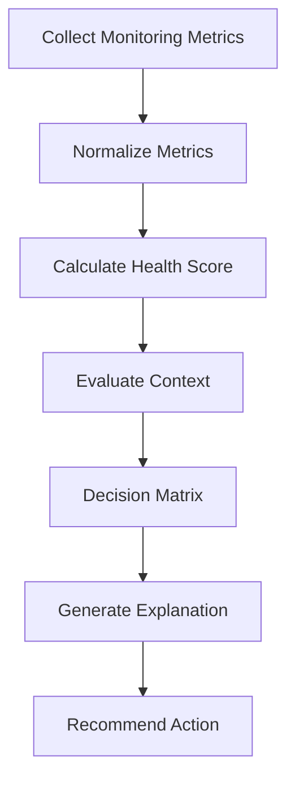

# AIMD Framework: Adaptive Intelligent Model Decision

**Project:** PhoenixML  
**Document Version:** 1.0  
**Last Updated:** July 2026

---

# 1. Introduction

Machine Learning models deployed in production are continuously exposed to changing data, evolving user behavior, infrastructure failures, and concept drift. Although modern MLOps platforms provide monitoring, experiment tracking, deployment, and version management, they generally depend on engineers to interpret monitoring results and decide the appropriate maintenance action.

PhoenixML introduces the **Adaptive Intelligent Model Decision (AIMD)** Framework—an explainable decision-support framework that analyzes multiple operational signals and recommends suitable maintenance actions. AIMD complements existing MLOps platforms by assisting engineers rather than replacing them.

---

# 2. Design Goals

The AIMD Framework is designed according to the following principles:

- Explainable decision making
- Multi-signal health assessment
- Context-aware recommendations
- Human-in-the-loop approval
- Easy integration with existing MLOps platforms
- Extensible architecture for future enhancements

---

# 3. Core Concepts

The AIMD framework follows five sequential stages:

1. Collect Monitoring Signals
2. Assess Model Health
3. Evaluate Operational Context
4. Recommend Maintenance Action
5. Explain the Recommendation

Unlike traditional monitoring systems, AIMD separates **monitoring** from **decision making**, enabling engineers to understand why a recommendation was generated.

---

# 4. Framework Architecture


---

# 5. Monitoring Signals

The framework evaluates multiple operational metrics simultaneously.

| Signal | Description |
|---------|-------------|
| Model Accuracy | Current production accuracy |
| Drift Score | Degree of data or concept drift |
| Prediction Confidence | Average prediction confidence |
| Data Quality | Missing values, invalid records, outliers |
| System Health | CPU usage, memory, latency, failures |
| Maintenance History | Previous retraining and deployments |
| Business Rules | Organization-specific constraints |

---

# 6. Metric Normalization

Since monitoring metrics have different scales, they are normalized to a common range (0–100) before evaluation.

Example:

| Metric | Original Value | Normalized |
|---------|---------------:|-----------:|
| Accuracy | 92% | 92 |
| Drift Score | 0.24 | 76 |
| Confidence | 0.89 | 89 |
| Data Quality | 97% | 97 |
| System Health | 94% | 94 |

---

# 7. Health Assessment

The overall model health is calculated using a weighted score.

## Health Score Formula

```
Health Score =
0.30 × Accuracy
+
0.25 × (100 − Drift Score)
+
0.15 × Confidence
+
0.15 × Data Quality
+
0.15 × System Health
```

## Health Classification

| Score | Status |
|-------:|--------|
| 90–100 | Excellent |
| 75–89 | Healthy |
| 60–74 | Warning |
| 40–59 | Poor |
| Below 40 | Critical |

---

# 8. Context Evaluation

Before recommending any maintenance action, AIMD evaluates contextual information such as:

- Recent retraining history
- Availability of labeled data
- Temporary vs persistent drift
- Business KPI status
- Infrastructure stability
- Maintenance frequency

This prevents unnecessary maintenance operations.

---

# 9. Decision Matrix

The decision engine maps the evaluated health status to an appropriate recommendation.

| Health | Drift | Confidence | Recommended Action |
|---------|--------|------------|-------------------|
| Excellent | Low | High | Continue Monitoring |
| Healthy | Low | High | Continue Monitoring |
| Warning | Medium | High | Increase Monitoring |
| Warning | High | Medium | Collect More Data |
| Poor | High | Medium | Train Candidate Model |
| Poor | High | Low | Champion–Challenger Evaluation |
| Critical | High | Low | Rollback |
| Unknown | Any | Any | Human Review |

---

# 10. Decision Algorithm

```text
Input Monitoring Metrics

↓

Normalize Metrics

↓

Calculate Health Score

↓

Evaluate Operational Context

↓

Lookup Decision Matrix

↓

Generate Recommendation

↓

Generate Explanation

↓

Return Decision
```

---

# 11. Explainability Engine

Every recommendation includes an explanation.

Example:

```json
{
  "recommended_action": "Train Candidate Model",

  "health_score": 58,

  "confidence": 91,

  "reasons": [
    "Accuracy dropped below threshold",
    "High concept drift detected",
    "Prediction confidence decreased",
    "No recent retraining performed"
  ]
}
```

This enables engineers to understand why the recommendation was generated.

---

# 12. Recommendation Workflow



---

# 13. Database Schema

Suggested table:

```sql
DecisionLog

--------------------------------------

id

model_id

timestamp

accuracy

drift_score

confidence

health_score

recommended_action

reason

approved_by

executed

execution_time
```

This table stores every recommendation generated by AIMD.

---

# 14. API Design

## Evaluate Model

```
POST /decision/evaluate
```

Example Request

```json
{
  "accuracy": 84,
  "drift_score": 72,
  "confidence": 81,
  "data_quality": 95,
  "system_health": 90
}
```

Example Response

```json
{
  "recommended_action": "Train Candidate Model",
  "health_score": 61,
  "status": "Warning",
  "confidence": 89,
  "reason": [
    "Accuracy below threshold",
    "High drift detected"
  ]
}
```

---

# 15. Example Scenario

Suppose:

- Accuracy = 84%
- Drift Score = High
- Confidence = Low
- Data Quality = Good
- No recent retraining

AIMD Recommendation:

```
Train Candidate Model
```

Reason:

- Accuracy degradation observed
- High concept drift
- No recent retraining
- Data quality remains acceptable

---

# 16. Advantages

The AIMD framework offers several benefits:

- Explainable recommendations
- Multi-signal decision making
- Reduced manual effort
- Better maintenance consistency
- Human oversight
- Easy integration with existing MLOps platforms
- Extensible architecture

---

# 17. Limitations

Current implementation has the following limitations:

- Rule-based decision engine
- Fixed decision thresholds
- Depends on monitoring quality
- Human approval required before deployment

---

# 18. Future Enhancements

Future versions may include:

- Reinforcement Learning–based decision policies
- Adaptive threshold optimization
- Cost-aware maintenance planning
- Federated ML support
- Kubernetes integration
- Kubeflow integration
- Multi-model optimization

---

# 19. Conclusion

The Adaptive Intelligent Model Decision (AIMD) Framework is the core innovation of PhoenixML. By combining monitoring metrics, health assessment, contextual analysis, and explainable decision logic, AIMD provides intelligent maintenance recommendations for production machine learning systems. Rather than replacing existing MLOps platforms, it complements them by improving transparency, consistency, and decision quality during model maintenance.