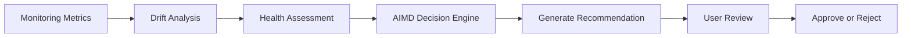
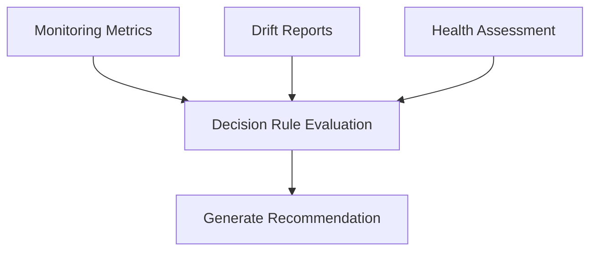
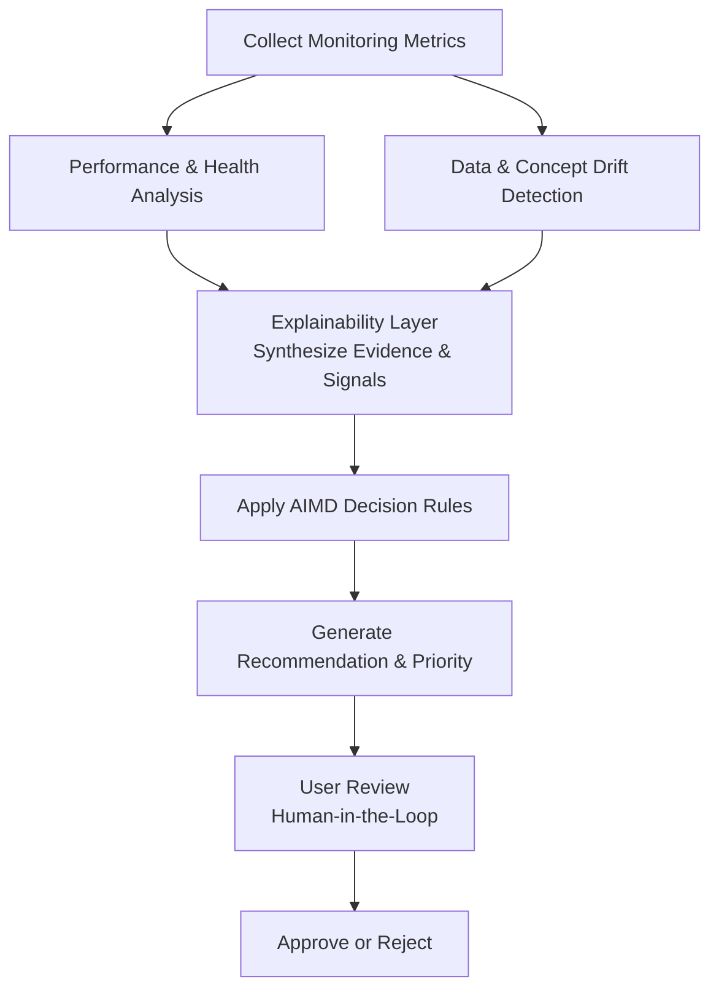
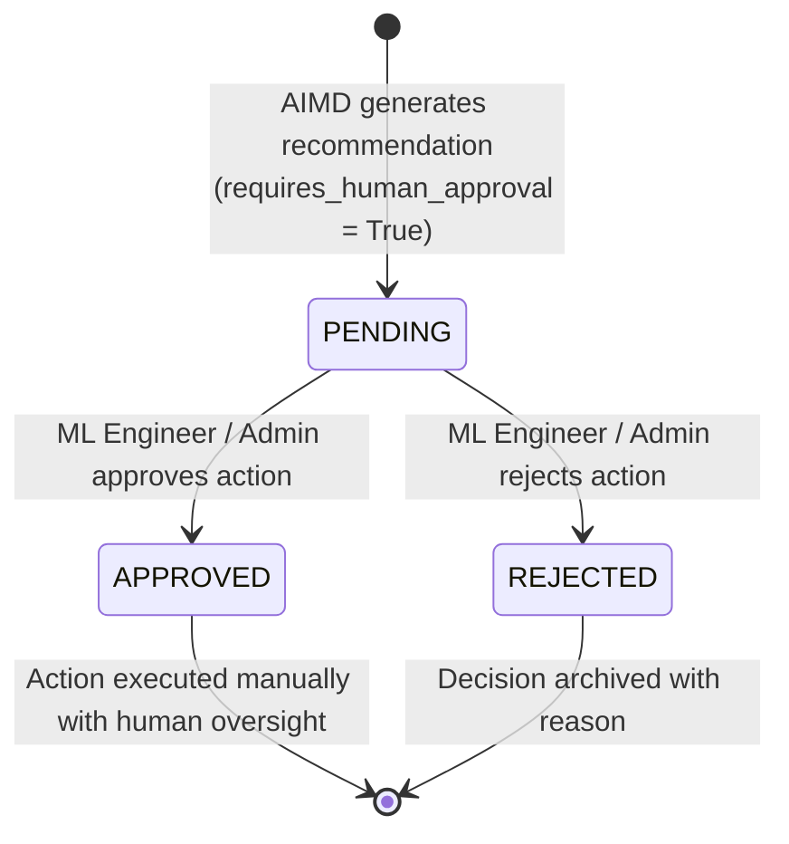

# Adaptive Intelligent Model Decision (AIMD) Engine

**Project:** PhoenixML – An Intelligent MLOps Decision Support Framework for Spam Email Detection

**Version:** 2.0

**Prepared By:** Shailendra Singh Rathore

**Document Type:** Decision Engine Design Document

---

# Revision History

| Version | Date | Author | Description |
|---------|------|--------|-------------|
| 1.0 | XX/XX/2026 | Shailendra Singh Rathore | Initial Decision Engine Document |
| 2.0 | XX/XX/2026 | Shailendra Singh Rathore | Updated AIMD framework for PhoenixML |

---

# Table of Contents

1. Introduction
2. Objectives
3. AIMD Overview
4. Decision-Making Philosophy
5. High-Level Decision Workflow

---

# 1. Introduction

## 1.1 Purpose

This document describes the design of the **Adaptive Intelligent Model Decision (AIMD) Engine**, the core decision-support component of **PhoenixML – An Intelligent MLOps Decision Support Framework for Spam Email Detection**.

The AIMD Engine analyzes monitoring metrics, drift detection results, and model health assessments to generate intelligent maintenance recommendations for deployed spam email detection models. Rather than automatically modifying deployed models, AIMD follows a **human-in-the-loop** approach where recommendations are reviewed and approved by authorized users before any maintenance action is taken.

This document explains the decision-making process, workflow, recommendation strategy, and design principles of the AIMD Engine.

---

## 1.2 Scope

This document focuses on the internal decision-support process of AIMD, including:

- Decision inputs
- Decision evaluation
- Recommendation generation
- Recommendation prioritization
- Human approval workflow
- Future enhancements

Implementation details of the software architecture, database schema, and API endpoints are covered in their respective design documents.

---

# 2. Objectives

The AIMD Engine has been designed with the following objectives:

### Intelligent Decision Support

Provide meaningful maintenance recommendations based on model performance and health rather than relying solely on manual analysis.

### Early Detection

Identify model degradation before it significantly impacts spam email classification performance.

### Explainability

Generate recommendations together with clear reasoning so that users understand why a particular action is suggested.

### Human Oversight

Ensure that all maintenance actions require explicit user approval, preventing unintended automated modifications.

### Extensibility

Support future integration of advanced decision-making techniques, including machine learning, reinforcement learning, and predictive analytics.

---

# 3. AIMD Overview

The Adaptive Intelligent Model Decision (AIMD) Engine acts as the intelligence layer of PhoenixML.

It receives monitoring metrics, drift reports, and health assessments from other system components. These inputs are evaluated using predefined decision rules to determine whether maintenance actions are necessary. Based on this evaluation, the engine generates recommendations such as continued monitoring, threshold adjustment, model retraining, or model replacement.

The current implementation uses a **rule-based decision strategy**, providing a transparent and explainable decision process suitable for academic implementation. The modular design also allows future replacement or extension of the rule-based logic with more advanced AI-driven decision models.

---

# 4. Decision-Making Philosophy

The AIMD Engine is guided by the following principles.

### Evidence-Based Decisions

Recommendations are generated only after evaluating measurable indicators such as monitoring metrics, drift scores, and health assessments.

### Explainable Recommendations

Every recommendation includes the reasoning behind the suggested action, allowing users to understand the factors influencing the decision.

### Human-in-the-Loop

The AIMD Engine does not perform maintenance actions automatically. Instead, it assists ML engineers by providing recommendations that require manual review and approval.

### Progressive Maintenance

Maintenance actions are selected according to the severity of the detected issues. Minor problems may require only continued monitoring, while severe degradation may warrant model retraining or replacement.

---

# 5. High-Level Decision Workflow

The AIMD Engine processes information through a sequence of evaluation stages.

The workflow begins with operational monitoring of the deployed spam detection model. Monitoring results are analyzed for data and concept drift, followed by health assessment. The AIMD Engine evaluates these inputs and generates an appropriate maintenance recommendation. The final decision remains under the control of the authorized user, ensuring transparency and accountability.

# 6. Decision Inputs

The AIMD Engine generates recommendations by analyzing information collected from multiple components of PhoenixML. Rather than relying on a single metric, the engine evaluates several indicators to obtain a comprehensive understanding of the operational state of each deployed spam email detection model.

The primary decision inputs are:

- Monitoring Metrics
- Drift Reports
- Health Assessment Results

Each input contributes to the overall evaluation process and influences the final recommendation.

---

## 6.1 Monitoring Metrics

Monitoring metrics provide information about the runtime performance of the deployed spam detection model.

Typical metrics include:

- Accuracy
- Precision
- Recall
- F1-Score

These metrics help determine whether the model continues to perform within acceptable operational thresholds.

---

## 6.2 Drift Reports

The Drift Detection component identifies changes in production data and model behavior that may degrade predictive efficacy.

The system distinguishes between two separate analytical signals:

- **Data Drift:** Changes in the marginal distribution of input features ($P(X)$) evaluated without ground-truth labels (e.g., via the Kolmogorov-Smirnov test).
- **Concept Drift:** Changes in the underlying relationship between inputs and ground-truth targets ($P(Y|X)$), such as evolving spamming patterns and shifting vocabularies. In email spam detection, virtual concept drift may also occur when the distribution of spam types changes over time.

### Concept Drift Operational Proxy

In PhoenixML, concept drift is detected via a **window-based performance comparison** between a historical reference labeled window and a current labeled window:
1. **Performance Metrics:** Evaluates Accuracy, Precision, Recall, and F1-Score for each labeled window under deterministic zero-division rules.
2. **Degradation Threshold:** Evaluates performance change ($\Delta_{\text{metric}} = \text{current} - \text{reference}$). If $\Delta_{\text{metric}} \le -0.05$ (default 5 percentage points) on any monitored metric, drift is flagged (`DRIFTED`).
3. **Minimum Sample Size:** Configurable threshold (default $\ge 2$). Windows below the threshold return `INSUFFICIENT_DATA` rather than false drift claims.
4. **Proxy Nature:** This is an operational monitoring signal/proxy, not a mathematical proof that $P(Y|X)$ has shifted.
5. **No Automatic Action:** Drift signals inform health assessments and provide input for future AIMD rule evaluation. No automated retraining or deployment action is executed autonomously.

---

## 6.3 Health Assessment

The Health Assessment component combines monitoring metrics and drift analysis to generate an overall health score.

Health status is categorized as:

| Health Status | Description |
|---------------|-------------|
| Healthy | Model is performing within acceptable limits |
| Warning | Performance degradation detected |
| Critical | Significant degradation requiring immediate attention |

The health assessment serves as the primary indicator used by the AIMD Engine during decision making.

### Proposed PhoenixML Health Score Policy

*Note: The following methodology represents an explicit project design decision mapping operational data to the health state, rather than being copied directly from the high-level project synopsis.*

**1. Normalization:**
All model metrics are evaluated in the range `[0,1]`. They are normalized to a standard `0-100` scale via: `normalized_metric = metric * 100`.

**2. Metric Weights:**
A weighted combination determines the final `0-100` score. For the Email Spam Detection use case, the provisional weights are:
- **F1-Score (40%):** Receives the highest weight because it balances precision and recall on inherently imbalanced spam datasets.
- **Precision (25%):** Highly critical, as false positives misclassify legitimate emails as spam, directly damaging user trust.
- **Recall (25%):** Important to capture true spam, but a false negative is typically less harmful than a false positive.
- **Accuracy (10%):** Retained as a general metric but given the lowest weight because accuracy can be artificially inflated on imbalanced sets.

**3. Missing Metrics Handling:**
Missing metrics are never treated as zero. If any metric is missing, its weight is redistributed proportionally among the remaining available metrics. If absolutely no metrics are available, the score evaluates to `None` with a status of `INSUFFICIENT_DATA`.

**4. Configurable Status Thresholds:**
The boundary mappings from a `0-100` score to Health Status are explicitly configurable:
- **Healthy:** `Score >= 80`
- **Warning:** `60 <= Score < 80`
- **Critical:** `Score < 60`
- **Insufficient Data:** Score is `None`

---

# 7. Decision Logic

The AIMD Engine follows a **rule-based decision strategy**. It evaluates the health status of the deployed model together with monitoring metrics and drift reports to determine the most appropriate maintenance recommendation.

The decision process follows three stages:

1. Evaluate monitoring metrics.
2. Analyze drift severity.
3. Assess overall model health.
4. Generate a recommendation based on predefined decision rules.

---

## 7.1 Decision Workflow

The workflow ensures that recommendations are based on multiple sources of evidence rather than a single performance metric.

---

# 8. Recommendation Strategy & Decision Matrix

The AIMD Engine recommends maintenance actions according to evaluated health status, drift signals, and performance trends.

| Condition / Evidence Pattern | Recommended Action (`AIMDAction`) | Priority (`AIMDPriority`) | Confidence (`AIMDConfidence`) | Rationale / Policy |
|------------------------------|-----------------------------------|---------------------------|-------------------------------|--------------------|
| **Critical Health** (Score < 60 or CRITICAL) + Verified Rollback Target Available | `ROLLBACK` | `CRITICAL` | `HIGH` / `MODERATE` | Severe operational degradation; verified stable predecessor model available for immediate reversion subject to human approval. |
| **Critical Health** (Score < 60 or CRITICAL) + No Rollback Target Available | `RETRAIN` | `CRITICAL` | `HIGH` / `MODERATE` | Rollback precluded by safety check (no target verified). Immediate retraining on recent verified data recommended. |
| **Concept Drift Detected** (Performance drop across labeled windows) | `RETRAIN` | `HIGH` / `CRITICAL` | `HIGH` / `MODERATE` | Shift in $P(Y \mid X)$ (e.g., emerging spam vocabulary/patterns); retraining required to align model weights with current concept. |
| **Performance Degradation** Without Detected Drift (Data or Concept) | `HUMAN_REVIEW` | `HIGH` / `MEDIUM` | `MODERATE` | Performance dropped but feature distributions and labeled concepts appear stable. Root cause uncharacterized; blind retraining avoided. |
| **Health Warning** (Score 60–79.9) With Concurrent Data Drift | `RETRAIN` | `HIGH` | `HIGH` | Feature distribution shift accompanied by declining composite health scores. Retraining recommended on recent operational data. |
| **Data Drift Detected** on Healthy/Stable Model ($\\ge 2$ features drifted) | `DATA_COLLECTION` | `MEDIUM` | `HIGH` / `MODERATE` | Input features shifted but current accuracy remains stable. Recommend gathering and labeling production samples from drifted subspace. |
| **Data Drift Detected** on Healthy/Stable Model (single feature drifted) | `INCREASED_MONITORING` | `MEDIUM` | `HIGH` / `MODERATE` | Distribution shift in isolated feature. Increase observation frequency to monitor for latent classification degradation. |
| **Healthy & Stable Model** (Score $\ge 80$, Stable/Improving, No Drift) | `CONTINUE_MONITORING` | `LOW` | `HIGH` | Model operating within acceptable operational tolerances. Standard monitoring cadence maintained. |
| **Insufficient Data / Missing Signals** | `HUMAN_REVIEW` | `MEDIUM` | `INSUFFICIENT` | Monitoring observations span zero time or metrics missing. Investigation of data collection and ingestion pipelines needed. |

---

### 8.1 Rollback Safety Invariant

Under PhoenixML safety policies:
- The engine **NEVER** recommends `ROLLBACK` solely because health is critical or concept drift is detected.
- `ROLLBACK` is evaluated against `historical_maintenance_context`:
  1. If `historical_maintenance_context` is missing, empty, or has `rollback_target_available = False`, `ROLLBACK` is **precluded**.
  2. In this event, the engine falls back to `RETRAIN` (Priority: `CRITICAL`), explicitly documenting that rollback was precluded due to lack of a verified target.
  3. This safety gate prevents production outages caused by rolling back to non-existent or corrupted model artifacts.

---

# 9. Recommendation Priority and Confidence

### 9.1 Priority Levels

To assist operators in prioritizing remediation, recommendations are assigned a deterministic urgency level:

| Priority | Operational Context | Response SLA |
|----------|---------------------|--------------|
| `CRITICAL` | Critical health score (< 60), severe classification collapse, or unmitigated concept drift | Immediate human operator triage and approval |
| `HIGH` | Concept drift detected, performance degradation without drift, or warning health with data drift | Prioritized scheduling during current operational cycle |
| `MEDIUM` | Data drift on stable models (data collection / increased monitoring) or insufficient monitoring data | Routine review and diagnostic evaluation |
| `LOW` | Model healthy and performance stable or improving | Standard observational logging |

### 9.2 Confidence Ratings

Confidence reflects the breadth and corroboration of independent analytical evidence:

| Confidence | Analytical Evidence Breadth |
|------------|-----------------------------|
| `HIGH` | Corroborated by 2 or more independent analytical sources (e.g., health assessment + performance trend + concept drift) |
| `MODERATE` | Supported by a primary strong analytical signal with limited corroborating metrics |
| `LOW` | Ambiguous or conflicting signals requiring expert triage |
| `INSUFFICIENT` | Missing observations or inputs marked `INSUFFICIENT_DATA` |

---

# 10. Explainable Decision Support & Human-in-the-Loop Contract

A core architectural principle of PhoenixML is transparent decision support:
1. **Explainability Synthesis:** AIMD consumes structured signals, severity ratings, and primary degradation factors from the upstream **Explainability Layer** (`ExplanationResult`), embedding them directly into `supporting_signals` and `evidence_summary`.
2. **Deterministic Rationale:** Every recommendation contains an unambiguous narrative explaining why an action was chosen, what evidence corroborated it, and whether alternatives (such as rollback) were precluded.
3. **Strict Human Approval Gate:** Every `AIMDRecommendation` has `requires_human_approval = True`. The engine cannot execute autonomous maintenance actions. The human operator retains exclusive authority to approve, reject, or modify recommendations.

# 11. Complete Decision Workflow

The AIMD Engine operates as the decision-support layer of PhoenixML by transforming monitoring information and explainability signals into actionable maintenance recommendations.

The complete decision-making process consists of the following stages:

1. Collect monitoring metrics from deployed spam email detection models.
2. Evaluate performance trends and compute model health assessment.
3. Detect data drift (feature distributions) and concept drift (performance across labeled windows).
4. Synthesize diagnostic observations in the **Explainability Layer** to identify primary degradation factors and supporting evidence.
5. Apply predefined AIMD decision rules against health status and explainability signals.
6. Generate an appropriate maintenance recommendation.
7. Assign a recommendation priority.
8. Present the recommendation and structured explainability evidence to the user for review.
9. Record the user's decision for auditability and compliance.

This structured workflow ensures that recommendations are generated consistently while maintaining transparency throughout the decision-making process.

---

## 11.1 Decision Flow Diagram

The workflow illustrates how multiple evaluation stages contribute to a final recommendation while ensuring that all maintenance decisions remain under human supervision.

---

# 12. Human-in-the-Loop Decision Process

PhoenixML follows a **human-in-the-loop** decision-making model.

Instead of automatically executing maintenance actions, the AIMD Engine serves as an intelligent assistant that supports ML engineers by providing evidence-based recommendations.

The decision process follows these principles:

- Recommendations are generated automatically based on deterministic rule evaluation.
- Explanations and corroborating signals accompany every recommendation.
- Users review the suggested action through the PhoenixML interface.
- Users explicitly approve or reject the recommendation.
- All recommendations and human approvals are permanently persisted in decision history.

This approach balances automation with human expertise, reducing operational risk while preserving user control.

---

## 12.1 Decision Persistence and Audit History (`DecisionLog`)

To guarantee transparency, accountability, and regulatory auditability, every recommendation generated by the AIMD Engine is persisted in the PostgreSQL database via the `decision_logs` table.

### 12.1.1 Database Schema (`decision_logs`)

| Column Name | Type | Constraints / Default | Description |
|---|---|---|---|
| `id` | UUID | Primary Key, default UUIDv4 | Unique identifier for the persisted decision record. |
| `model_id` | UUID | Foreign Key (`registered_models.id`, ON DELETE CASCADE), Index, Not Null | Associated registered spam email detection model. |
| `created_at` | DateTime (with timezone) | Default `now()`, Not Null | Timestamp when the recommendation was generated (UTC). |
| `health_score` | Float | Nullable, Range [0.0, 100.0] | Composite model health score evaluated at decision time. |
| `health_status` | String(50) | Nullable | Model health status classification (`HEALTHY`, `WARNING`, `CRITICAL`, `INSUFFICIENT_DATA`). |
| `recommended_action` | Enum (`aimdaction`) | Not Null | Suggested maintenance action (`CONTINUE_MONITORING`, `INCREASED_MONITORING`, `RETRAIN`, `ROLLBACK`, `DATA_COLLECTION`, `HUMAN_REVIEW`). |
| `priority` | Enum (`aimdpriority`) | Not Null | Operational urgency rating (`CRITICAL`, `HIGH`, `MEDIUM`, `LOW`). |
| `confidence` | Float | Nullable, Range [0.0, 1.0] | Normalized confidence score reflecting evidence corroboration. |
| `rationale` | Text | Not Null, Non-empty | Plain-text justification detailing the rule evaluation and signal synthesis. |
| `explanation` | Text | Nullable | Structured diagnostic explanation synthesized from the explainability layer. |
| `supporting_signals` | JSON | Nullable | Raw metric shifts, drifted feature lists, and analytical signal payloads. |
| `requires_human_approval` | Boolean | Default `True`, Not Null | Invariant safety flag enforcing human-in-the-loop oversight before action execution. |
| `approval_status` | Enum (`approvalstatus`) | Default `PENDING`, Not Null | Lifecycle approval state: `PENDING`, `APPROVED`, or `REJECTED`. |

### 12.1.2 Approval Status Lifecycle

1. **PENDING:** Initial state upon generation. The recommendation is queued in the audit log for review by authorized ML engineers or Administrators.
2. **APPROVED:** An authorized human user has evaluated the supporting evidence, drift reports, and rationale, confirming that the recommended action should be carried out.
3. **REJECTED:** An authorized human user has reviewed the recommendation and determined that the action is not required or inappropriate given external business context.

### 12.1.3 Invariant Safety Policy

- **No Autonomous Execution:** PhoenixML will **never** automatically apply retrain scripts, alter production routing, or execute rollbacks upon recommendation generation.
- **Audit Integrity:** Recommendations cannot be silently altered or discarded; each record maintains an immutable snapshot of model condition and analytical signals at evaluation time.
- **Model Cascade Integrity:** If a `RegisteredModel` is deleted, its associated `decision_logs` records are cleaned up via cascading deletion (`ON DELETE CASCADE`), preventing orphaned records.

### 12.1.4 Decision Service Integration (`DecisionService`)

The orchestration layer (`backend/app/decisions/service.py`) bridges analytical evaluation and persistent audit logging:
- **Orchestration & Invocation:** Accepts operational context (`AIMDContext` or individual monitoring results) and invokes `AIMDDecisionEngine.evaluate()`.
- **Mapping & Schema Validation:** Maps the resulting `AIMDRecommendation` into `DecisionLogCreate`, normalizing confidence ratings to numeric scores ($[0.0, 1.0]$), synthesizing diagnostic explanations, and attaching supporting signal payloads.
- **Persistence:** Persists the recommendation to the database via `DecisionLogRepository`, defaulting `approval_status` to `PENDING` and strictly enforcing `requires_human_approval = True`.
- **Clean Separation:** Pure domain decision rules remain strictly in `AIMDDecisionEngine`, the repository handles database access, and `DecisionService` coordinates orchestration and transaction rollback safety without duplicating rule evaluation.

### 12.1.5 Decision History Read and Query Service

To support dashboard visualizations, historical timeline inspection, and future decision-history REST APIs, the decision layer provides a dedicated read and query interface on `DecisionService`:
- **Single Decision Retrieval (`get_decision` / `get_decision_for_model`):** Retrieves individual decision records by primary key with model-scoping and authorization checks.
- **Model-Scoped Decision Listing (`list_decisions_for_model` / `list_decisions`):** Lists historical recommendations for a specified registered model ordered chronologically (**newest first**).
- **Pagination & Aggregation (`get_decision_history`):** Supports offset (`skip`) and page size (`limit`) pagination alongside total decision counts (`count_decisions_for_model`), returning structured `DecisionHistoryResponse` payloads consumable by UI dashboards.
- **Ownership & RBAC Enforcement:** Enforces model ownership policies at the service boundary. Model owners and system Administrators can inspect decision logs; unauthorized cross-user access attempts raise HTTP 403 (`AuthorizationError`), while nonexistent models or decisions raise HTTP 404 (`HTTPException`).
- **Complete Schema Preservation:** Read models preserve all evaluation outputs, including action, priority, confidence rating, rationale, diagnostic explanation, corroborating signal payloads, `requires_human_approval`, and `approval_status`.

### 12.1.6 Decision Approval Workflow Foundation

To transition maintenance recommendations from initial review to operational resolution, PhoenixML establishes a controlled, auditable approval workflow:

#### 1. Lifecycle States & Transitions
- **Allowed States:** `PENDING`, `APPROVED`, `REJECTED`.
- **Allowed Transitions:**
  - `PENDING` $\rightarrow$ `APPROVED`: Authorized human review accepts the recommendation.
  - `PENDING` $\rightarrow$ `REJECTED`: Authorized human review rejects the recommendation based on external context.
  - `APPROVED` $\rightarrow$ `APPROVED`: Idempotent confirmation (returns current record without modification).
  - `REJECTED` $\rightarrow$ `REJECTED`: Idempotent confirmation (returns current record without modification).
- **Forbidden Transitions (Finalized Decisions Cannot Be Reversed):**
  - `APPROVED` $\rightarrow$ `REJECTED`: Rejected (HTTP 400). Finalized approved decisions cannot be overwritten.
  - `REJECTED` $\rightarrow$ `APPROVED`: Rejected (HTTP 400). Finalized rejected decisions cannot be overwritten.
  - `APPROVED` / `REJECTED` $\rightarrow$ `PENDING`: Rejected (HTTP 400). Finalized decisions cannot be re-opened.

#### 2. Role-Based Access Control (RBAC) Policies
- **Administrator (`UserRole.ADMIN`):** Possesses global administrative authority to review, approve, or reject recommendations across all deployed models.
- **ML Engineer (`UserRole.ML_ENGINEER`):** Authorized to review, approve, or reject recommendations strictly on models they own (`model.owner_id == user.id`). Cross-model approval attempts are denied with HTTP 403 (`AuthorizationError`).
- **Viewer (`UserRole.VIEWER`):** Under the project's least-privilege safety policy, Viewers have strictly read-only visibility. Any attempt by a Viewer to modify approval status is denied with HTTP 403 (`AuthorizationError`).

#### 3. Data Integrity & Field Immutability
Approval updates are strictly confined to `approval_status`. The schema and service enforce that all analytical and diagnostic fields remain completely immutable:
- `recommended_action`, `priority`, `confidence`
- `rationale`, `explanation`, `supporting_signals`
- `health_score`, `health_status`, `requires_human_approval`
- `model_id`, `created_at`

#### 4. Explicit Non-Autonomous Invariant
> **CRITICAL ARCHITECTURAL GUARANTEE:** Transitioning an AIMD decision to `APPROVED` does **NOT** autonomously trigger retraining scripts, rollback model checkpoints, deploy replacement artifacts, or execute pipeline modifications. PhoenixML remains an MLOps decision-support platform; all downstream production maintenance actions require human execution.

### 12.1.7 Observation-to-AIMD Model Evaluation Pipeline

To bridge persisted monitoring telemetry with the AIMD decision engine, PhoenixML provides an end-to-end evaluation pipeline in `DecisionService.evaluate_model()`:

1. **Telemetry Retrieval & Ordering:**
   - Retrieves historical operational observations from `MonitoringObservationRepository`.
   - Normalizes and sorts observations chronologically by `observed_at` to ensure robust time-series comparisons regardless of database insertion order.
2. **Analytical Synthesis:**
   - **Health Assessment:** `HealthAssessor.assess()` evaluates the most recent observation's classification metrics (F1, precision, recall, accuracy), computing a composite health score ($[0, 100]$) and status (`healthy`, `warning`, `critical`).
   - **Performance Trends:** `PerformanceAnalyzer.analyze()` tracks longitudinal metric trajectories across observations (`improving`, `stable`, `degraded`).
   - **Operational Explainability:** `ExplainabilityAnalyzer.explain()` correlates health, performance degradation, and drift signals into diagnostic explanations and primary operational factors.
   - **Graceful Zero-Observation Handling:** When a model has no observations, the service synthesizes an `insufficient_data` context. The AIMD engine deterministically outputs a safe `HUMAN_REVIEW` recommendation (priority: `MEDIUM`, confidence: `INSUFFICIENT`).
3. **Deterministic AIMD Evaluation:**
   - Aggregates analytical outputs into `AIMDContext` and invokes `AIMDDecisionEngine.evaluate()`.
4. **Audit Persistence & Human-in-the-Loop Safeguards:**
   - Persists the generated recommendation into the `decision_logs` table via `DecisionLogRepository`.
   - Strictly enforces `requires_human_approval = True` and initializes with `approval_status = ApprovalStatus.PENDING`.
   - Exposed via authenticated REST endpoint: `POST /api/spam-models/{model_id}/decisions/evaluate` (RBAC: `ADMIN` global, `ML_ENGINEER` model owner; `VIEWER` forbidden).

---

# 13. Future Evolution of AIMD

The current implementation of the AIMD Engine is based on predefined decision rules. This approach provides transparency, ease of implementation, and explainable recommendations suitable for an academic project.

Future versions of PhoenixML may extend the decision engine with more advanced capabilities, including:

- Machine learning–based recommendation models.
- Reinforcement learning for adaptive decision policies.
- Predictive maintenance using historical monitoring trends.
- Integration with MLflow and other MLOps platforms.
- Automated recommendation confidence scoring.
- Multi-model decision support for large-scale deployments.

The modular design of AIMD allows these enhancements to be incorporated without fundamentally changing the surrounding system architecture.

---

# 14. Advantages of the AIMD Engine

The Adaptive Intelligent Model Decision Engine offers several benefits for maintaining deployed machine learning models.

### Intelligent Decision Support

Transforms monitoring data into actionable maintenance recommendations.

### Explainability

Provides clear reasoning behind every recommendation, improving user understanding and trust.

### Human Oversight

Ensures that maintenance actions are reviewed and approved before implementation.

### Modularity

Operates independently from monitoring, database, and user interface components, allowing future improvements without affecting the overall system.

### Extensibility

Supports future integration of AI-driven decision-making techniques while preserving compatibility with the existing architecture.

---

# 15. Conclusion

The Adaptive Intelligent Model Decision (AIMD) Engine is the core intelligence component of **PhoenixML – An Intelligent MLOps Decision Support Framework for Spam Email Detection**.

By combining monitoring metrics, drift analysis, and health assessments, the AIMD Engine generates transparent, evidence-based maintenance recommendations that assist users in maintaining the performance and reliability of deployed spam email detection models.

The current rule-based implementation provides a practical and explainable decision-support mechanism suitable for academic use, while the modular architecture enables future enhancements using advanced machine learning and predictive analytics techniques.

---

# References

1. Google. *Rules of Machine Learning: Best Practices for ML Engineering.*
2. Sculley, D., et al. *Hidden Technical Debt in Machine Learning Systems.*
3. Breck, E., et al. *The ML Test Score: A Rubric for ML Production Readiness.*
4. IEEE Std 1016-2009 – IEEE Standard for Software Design Descriptions.
5. ISO/IEC/IEEE 12207 – Systems and Software Engineering.
6. Scikit-learn Documentation.
7. MLflow Documentation.
