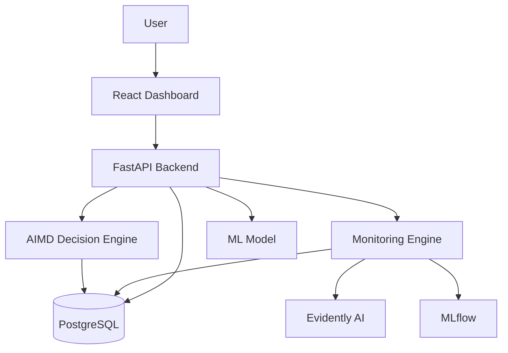
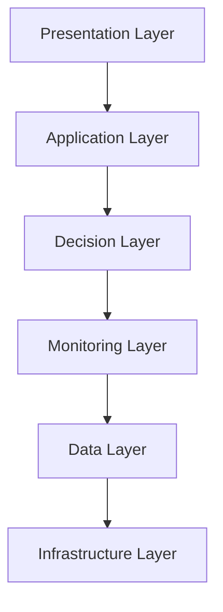
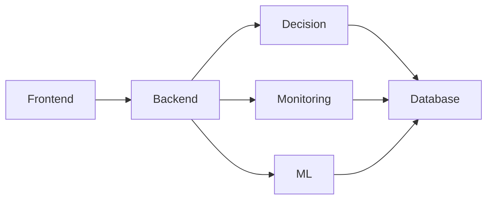
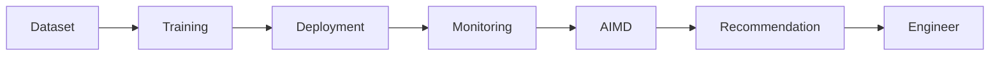
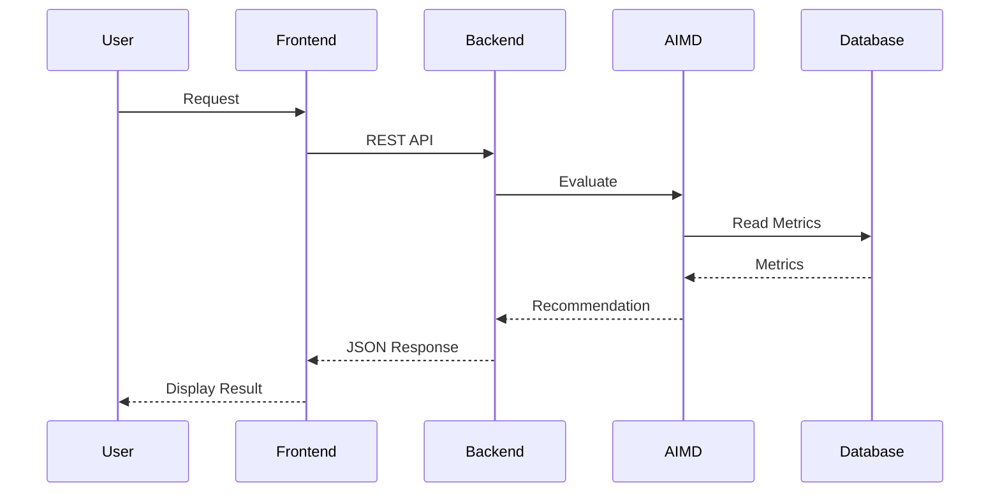
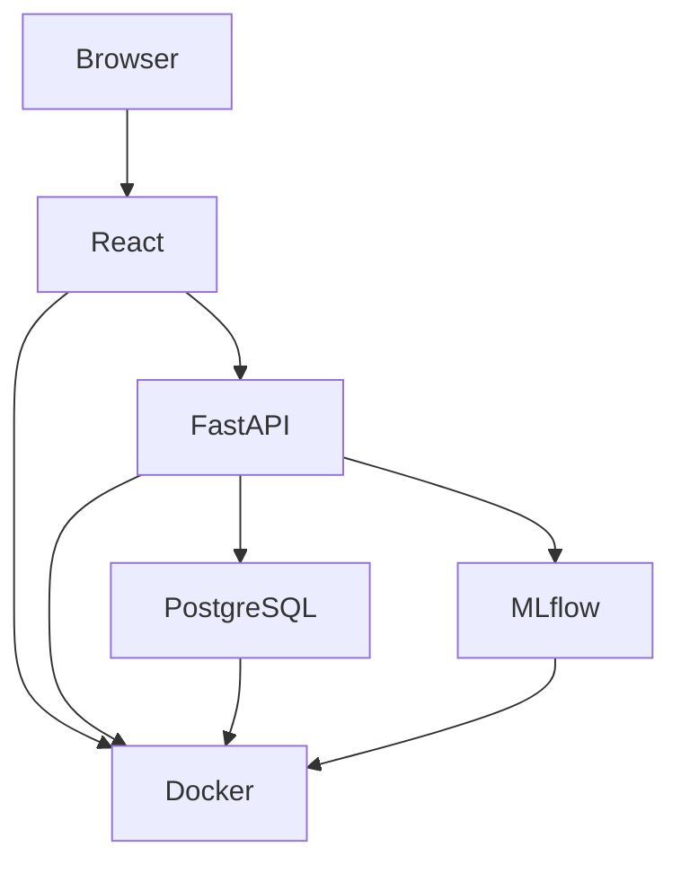

# PhoenixML System Architecture

**Project:** PhoenixML  
**Document Version:** 1.0  
**Last Updated:** July 2026

---

# 1. Introduction

PhoenixML is an explainable decision-support platform for production Machine Learning (ML) maintenance. It integrates model monitoring, health assessment, and intelligent maintenance recommendations through the Adaptive Intelligent Model Decision (AIMD) Framework.

Rather than replacing existing MLOps platforms, PhoenixML acts as an intelligent decision layer that helps engineers determine the most appropriate maintenance action using multiple monitoring signals.

---

# 2. Architecture Goals

The architecture is designed to achieve the following objectives:

- Modular and scalable design
- Separation of responsibilities
- Explainable decision making
- Easy integration with existing MLOps platforms
- Secure REST API communication
- Future extensibility

---

# 3. High-Level System Architecture



---

# 4. Layered Architecture

PhoenixML follows a layered architecture to improve maintainability and scalability.



---

## 4.1 Presentation Layer

Responsible for user interaction.

Components:

- Dashboard
- Login
- Model Management
- Monitoring Dashboard
- AIMD Recommendations
- Decision History
- Settings

Technology:

- React
- TypeScript
- Tailwind CSS

---

## 4.2 Application Layer

Implements REST APIs and business logic.

Responsibilities:

- Authentication
- Request validation
- API routing
- Service orchestration
- Database communication

Technology:

- FastAPI
- SQLAlchemy
- JWT Authentication

---

## 4.3 Decision Layer

Core innovation of PhoenixML.

Responsible for:

- Health Score Calculation
- Context Evaluation
- Decision Matrix
- Recommendation Generation
- Explainability

Main component:

Adaptive Intelligent Model Decision (AIMD)

---

## 4.4 Monitoring Layer

Collects production metrics.

Examples:

- Accuracy
- Drift
- Confidence
- Latency
- Data Quality
- Resource Usage

Tools:

- Evidently AI
- MLflow

---

## 4.5 Data Layer

Stores persistent information.

Database tables include:

- Users
- Models
- Monitoring Metrics
- Decision Logs
- Model Versions
- Training Runs

Technology:

PostgreSQL

---

## 4.6 Infrastructure Layer

Deployment environment.

Includes:

- Docker
- Docker Compose
- Environment Configuration
- Logging
- Reverse Proxy (Optional)

---

# 5. Component Architecture



---

# 6. Backend Architecture

```
backend/

├── api/
│
├── core/
│
├── database/
│
├── models/
│
├── schemas/
│
├── services/
│
├── decision_engine/
│
├── monitoring/
│
├── ml/
│
├── auth/
│
├── utils/
│
└── main.py
```

---

## Module Responsibilities

### api/

REST API endpoints.

### auth/

Authentication and authorization.

### database/

Database configuration.

### models/

SQLAlchemy models.

### schemas/

Pydantic schemas.

### services/

Business logic.

### monitoring/

Monitoring metrics collection.

### decision_engine/

Implementation of AIMD.

### ml/

Machine learning operations.

### utils/

Helper functions.

---

# 7. Frontend Architecture

```
frontend/

src/

components/

pages/

hooks/

services/

contexts/

utils/

assets/

App.tsx
```

---

## Main Pages

- Dashboard
- Models
- Monitoring
- Recommendations
- Decision Logs
- Settings
- Login

---

# 8. Data Flow



---

# 9. Database Architecture

Main Entities

```
Users

Models

ModelVersions

MonitoringMetrics

DecisionLogs

TrainingRuns
```

Relationships

```
User

↓

Models

↓

Model Versions

↓

Monitoring Metrics

↓

Decision Logs
```

---

# 10. API Communication



---

# 11. Technology Stack

| Layer | Technology |
|---------|------------|
| Frontend | React |
| Styling | Tailwind CSS |
| Language | TypeScript |
| Backend | FastAPI |
| Authentication | JWT |
| ORM | SQLAlchemy |
| Database | PostgreSQL |
| Monitoring | Evidently AI |
| Experiment Tracking | MLflow |
| ML Library | Scikit-learn |
| Deployment | Docker |

---

# 12. Security Architecture

Security features include:

- JWT Authentication
- Password hashing
- Role-based access control
- API validation
- Input sanitization
- HTTPS deployment
- Environment variable configuration

---

# 13. Deployment Architecture



---

# 14. Design Principles

The architecture follows these principles:

- Modularity
- Separation of concerns
- Scalability
- Maintainability
- Explainability
- Reusability
- Extensibility

---

# 15. Future Architecture Enhancements

Future versions may include:

- Kubernetes deployment
- Distributed monitoring
- Multi-model orchestration
- Federated learning support
- Reinforcement learning–based decision engine
- Cloud-native deployment

---

# 16. Conclusion

The PhoenixML architecture provides a modular and scalable foundation for intelligent machine learning maintenance. By separating presentation, application, monitoring, decision-making, and data management into independent layers, the system becomes easier to maintain, extend, and integrate with existing MLOps ecosystems. The AIMD Framework serves as the core decision-support component, enabling transparent and explainable maintenance recommendations for production ML systems.