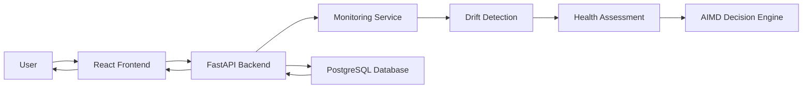
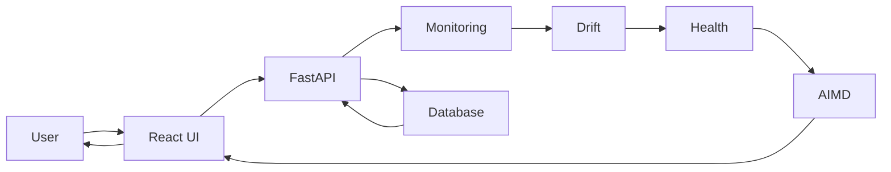
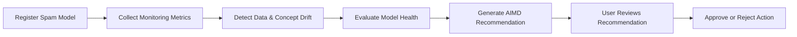
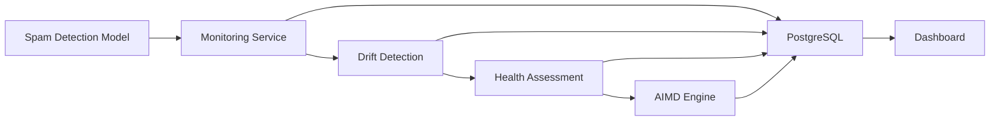
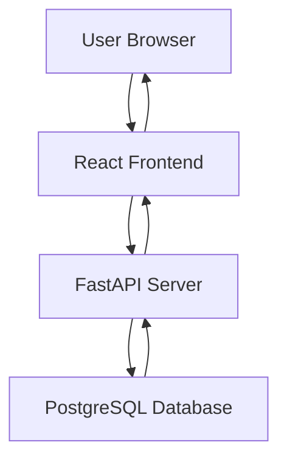

# System Architecture Document

**Project:** PhoenixML – An Intelligent MLOps Decision Support Framework for Spam Email Detection

**Version:** 2.0

**Prepared By:** Shailendra Singh Rathore

**Document Type:** System Architecture Document

---

# Revision History

| Version | Date | Author | Description |
|---------|------|--------|-------------|
| 1.0 | XX/XX/2026 | Shailendra Singh Rathore | Initial Architecture Document |
| 2.0 | XX/XX/2026 | Shailendra Singh Rathore | Updated architecture for PhoenixML |

---

# Table of Contents

1. Introduction
2. Architecture Objectives
3. System Overview
4. Architectural Principles
5. High-Level Architecture

---

# 1. Introduction

## 1.1 Purpose

This document presents the overall architecture of **PhoenixML – An Intelligent MLOps Decision Support Framework for Spam Email Detection**.

The architecture illustrates how the major components of the system collaborate to monitor deployed spam email detection models, evaluate their operational health, and generate intelligent maintenance recommendations through the Adaptive Intelligent Model Decision (AIMD) engine.

Unlike the Software Design Document, which focuses on internal software modules and implementation structure, this document provides a system-level view of PhoenixML, describing the interaction between its major architectural components.

---

## 1.2 Scope

This document covers the architectural organization of PhoenixML, including:

- User Interface
- Backend Services
- Monitoring Pipeline
- Drift Detection
- Health Assessment
- AIMD Decision Engine
- Database Layer

Implementation details such as database schema, API endpoints, and software modules are documented separately in their respective design documents.

---

# 2. Architecture Objectives

The architecture has been designed to achieve the following objectives:

### Modularity

Each architectural component performs a well-defined responsibility, allowing independent development and maintenance.

### Scalability

The system supports monitoring multiple deployed spam detection models and can be extended to larger deployments.

### Maintainability

Clear separation between system components simplifies future updates and feature additions.

### Reliability

Continuous monitoring and health assessment enable timely identification of model degradation.

### Extensibility

The architecture allows future integration of automated retraining pipelines, external MLOps tools, and additional machine learning domains.

---

# 3. System Overview

PhoenixML is an MLOps decision-support framework that supervises deployed spam email detection models.

The framework continuously collects operational metrics, evaluates model health, detects data and concept drift, and generates maintenance recommendations through the AIMD engine. Rather than automatically modifying deployed models, PhoenixML follows a **human-in-the-loop** approach in which recommendations are reviewed and approved by authorized users before any maintenance action is taken.

This architecture improves the reliability and long-term performance of machine learning systems while ensuring that important operational decisions remain under human control.

---

# 4. Architectural Principles

The PhoenixML architecture is based on several established software engineering principles.

### Separation of Concerns

Each architectural layer performs a distinct responsibility, reducing dependencies between components.

### Loose Coupling

Components communicate through clearly defined interfaces, enabling independent development and testing.

### High Cohesion

Each subsystem focuses on a specific functional responsibility, improving readability and maintainability.

### Human-in-the-Loop Decision Support

The AIMD engine provides recommendations rather than executing maintenance actions automatically, ensuring that final decisions remain under user control.

### Layered Communication

System components communicate only with adjacent layers, improving modularity and reducing complexity.

---

# 5. High-Level System Architecture

PhoenixML follows a layered architecture that separates presentation, business logic, intelligent decision support, and data persistence.

The architecture begins with user interaction through the React-based frontend. Requests are processed by the FastAPI backend, which coordinates monitoring operations and stores application data. Monitoring results are analyzed by the Drift Detection component, followed by Health Assessment. The AIMD engine evaluates the health information and produces maintenance recommendations, which are presented to users for review and approval. All application data, reports, and recommendations are maintained within the PostgreSQL database.

# 6. Architectural Components

PhoenixML consists of several interconnected architectural components. Each component performs a specific responsibility while collaborating with other components to provide continuous monitoring and intelligent decision support for deployed spam email detection models.

---

## 6.1 User Interface Layer

### Purpose

The User Interface Layer provides the primary interaction point between users and the PhoenixML system. It enables users to manage deployed models, view monitoring results, review AIMD recommendations, and generate reports.

### Responsibilities

- User authentication
- Dashboard visualization
- Spam model management
- Monitoring dashboards
- Health reports
- Recommendation review
- Notification display

**Technology:** React.js

---

## 6.2 Backend Service Layer

### Purpose

The Backend Service Layer acts as the central coordinator of the application. It processes client requests, applies business rules, communicates with the database, and coordinates monitoring and decision-support services.

### Responsibilities

- Process API requests
- Authenticate users
- Manage business logic
- Coordinate monitoring workflows
- Store and retrieve application data

**Technology:** FastAPI

---

## 6.3 Monitoring Service

### Purpose

The Monitoring Service continuously collects operational information from deployed spam email detection models.

The collected metrics provide the foundation for health evaluation and drift analysis.

### Responsibilities

- Collect performance metrics
- Record monitoring history
- Forward metrics for analysis
- Maintain monitoring records

---

## 6.4 Drift Detection Component

### Purpose

The Drift Detection Component analyzes monitoring data to determine whether the deployed model is experiencing significant changes in production data.

It evaluates both:

- Data Drift
- Concept Drift

### Responsibilities

- Analyze feature distribution changes
- Detect performance degradation
- Calculate drift scores
- Generate drift reports

---

## 6.5 Health Assessment Component

### Purpose

The Health Assessment Component evaluates the operational condition of deployed spam detection models.

It combines monitoring metrics and drift analysis results to calculate an overall health score.

### Responsibilities

- Evaluate model health
- Assign health status
- Generate health reports
- Forward evaluation results to the AIMD engine

---

## 6.6 AIMD Decision Engine

### Purpose

The Adaptive Intelligent Model Decision (AIMD) Engine is the core decision-support component of PhoenixML.

Based on monitoring results, drift reports, and health assessments, the engine generates maintenance recommendations that assist ML engineers in making informed decisions.

Unlike automated maintenance systems, AIMD follows a **human-in-the-loop** approach where recommendations require user review before implementation.

### Responsibilities

- Analyze model health
- Generate maintenance recommendations
- Assign recommendation priority
- Explain generated decisions

---

## 6.7 Database Layer

### Purpose

The Database Layer stores all persistent application data.

It maintains user information, model metadata, monitoring history, drift reports, health assessments, recommendations, notifications, and reporting information.

### Responsibilities

- Data storage
- Data retrieval
- Relationship management
- Historical record maintenance

**Technology:** PostgreSQL

---

# 7. Component Interaction

The following diagram illustrates how the architectural components collaborate during normal system operation.

The interaction begins when a user performs an operation through the web interface. The backend processes the request and coordinates monitoring activities. Monitoring results are analyzed for drift, followed by health assessment. The AIMD engine evaluates the overall condition of the deployed model and generates maintenance recommendations, which are returned to the user through the frontend interface. Persistent information is stored and retrieved from the PostgreSQL database throughout this workflow.

# 8. System Workflow

The PhoenixML architecture follows a sequential workflow that continuously monitors deployed spam email detection models and assists users in making maintenance decisions.

The workflow begins when a user registers a spam detection model through the web interface. The backend stores the model information and enables continuous monitoring. Operational metrics collected from the deployed model are analyzed to detect performance degradation and distribution changes. These results are then used to evaluate the model's health.

Finally, the AIMD Decision Engine generates maintenance recommendations, which are presented to the user for review and approval before any action is taken.

---

## 8.1 System Workflow Diagram

This workflow demonstrates the continuous monitoring cycle followed by PhoenixML. The framework emphasizes **human-assisted decision making**, ensuring that maintenance actions are reviewed before implementation.

---

# 9. Data Flow Architecture

The data flow architecture illustrates how information moves between the major architectural components.

Monitoring metrics collected from deployed models are processed by the Drift Detection component. The resulting drift analysis is forwarded to the Health Assessment component, which evaluates the overall condition of the model. The AIMD engine then generates maintenance recommendations based on these results. All generated information is stored in the database and presented to users through the dashboard.

---

## 9.1 Data Flow Diagram

This architecture ensures that every stage of the monitoring lifecycle is recorded, enabling historical analysis, reporting, and future decision support.

---

# 10. Deployment Architecture

PhoenixML is deployed as a web-based application consisting of a client application, backend server, and relational database.

Users access the application through a web browser. The React frontend communicates with the FastAPI backend using REST APIs. The backend executes business logic, coordinates monitoring services, and interacts with the PostgreSQL database to store and retrieve persistent data.

---

## 10.1 Deployment Diagram

The deployment architecture separates presentation, application logic, and data storage into independent components. This structure improves scalability, maintainability, and ease of deployment across development and production environments.

---

# 11. Communication Flow

Communication between system components follows a request-response model.

1. The user performs an action through the frontend.
2. The frontend sends an HTTP request to the backend.
3. The backend validates the request and executes the required business logic.
4. Monitoring, drift detection, and health assessment components process the relevant data.
5. The AIMD engine generates recommendations when necessary.
6. The backend retrieves or stores data in the PostgreSQL database.
7. A standardized JSON response is returned to the frontend.
8. The frontend displays the results to the user.

This communication model ensures consistent interaction between architectural components while maintaining clear separation of responsibilities.

# 12. Technology Architecture

PhoenixML is built using a modern technology stack that supports scalability, maintainability, and efficient machine learning operations.

| Layer | Technology | Purpose |
|--------|------------|---------|
| Frontend | React.js | User interface and dashboard |
| Backend | FastAPI | Business logic and REST APIs |
| Programming Language | Python | Backend development and ML integration |
| Database | PostgreSQL | Persistent data storage |
| ORM | SQLAlchemy | Database interaction |
| Authentication | JWT | Secure user authentication |
| Machine Learning | Scikit-learn | Spam detection model integration |
| Data Processing | Pandas, NumPy | Data manipulation and analysis |
| Version Control | Git & GitHub | Source code management |

Each technology has been selected based on its performance, community support, and compatibility with modern MLOps applications.

---

# 13. Architectural Quality Attributes

The PhoenixML architecture has been designed to satisfy several important software quality attributes.

## 13.1 Scalability

The modular architecture supports the addition of new models, users, monitoring records, and decision-support capabilities without requiring significant architectural changes.

---

## 13.2 Maintainability

Independent architectural components simplify debugging, testing, and future enhancements. Changes within one component have minimal impact on other parts of the system.

---

## 13.3 Reliability

Continuous monitoring, health assessment, and recommendation generation enable early detection of model degradation and support informed maintenance decisions.

---

## 13.4 Security

The architecture incorporates JWT-based authentication, role-based authorization, secure API communication, and controlled access to sensitive resources.

---

## 13.5 Extensibility

The system is designed to accommodate future enhancements such as:

- Automated model retraining
- MLflow integration
- Monitoring multiple machine learning domains
- Real-time monitoring dashboards
- Cloud-native deployment

---

# 14. Advantages of the Proposed Architecture

The proposed architecture provides several benefits for the PhoenixML framework:

- Modular organization of system components.
- Clear separation between presentation, application logic, and data management.
- Continuous monitoring of deployed spam detection models.
- Intelligent decision support through the AIMD engine.
- Human-in-the-loop maintenance workflow.
- Flexible architecture for future expansion.
- Efficient communication using RESTful APIs.
- Centralized and reliable data management.

These advantages contribute to a robust and maintainable system suitable for both academic implementation and future real-world deployment.

---

# 15. Conclusion

This System Architecture Document presents the overall architectural design of **PhoenixML – An Intelligent MLOps Decision Support Framework for Spam Email Detection**.

The architecture organizes the system into distinct layers responsible for user interaction, business services, monitoring, drift detection, health assessment, intelligent decision support, and data persistence. Through continuous monitoring and the Adaptive Intelligent Model Decision (AIMD) engine, PhoenixML assists users in maintaining the performance and reliability of deployed spam email detection models.

By emphasizing modularity, scalability, maintainability, and human-assisted decision making, the architecture provides a strong foundation for future enhancements and broader adoption in MLOps environments.

---

# References

1. Bass, L., Clements, P., & Kazman, R. *Software Architecture in Practice*. Addison-Wesley.
2. Richards, M., & Ford, N. *Fundamentals of Software Architecture*. O'Reilly Media.
3. FastAPI Documentation.
4. React Documentation.
5. PostgreSQL Documentation.
6. Scikit-learn Documentation.
7. IEEE Std 1471 / ISO/IEC/IEEE 42010 – Systems and Software Architecture.