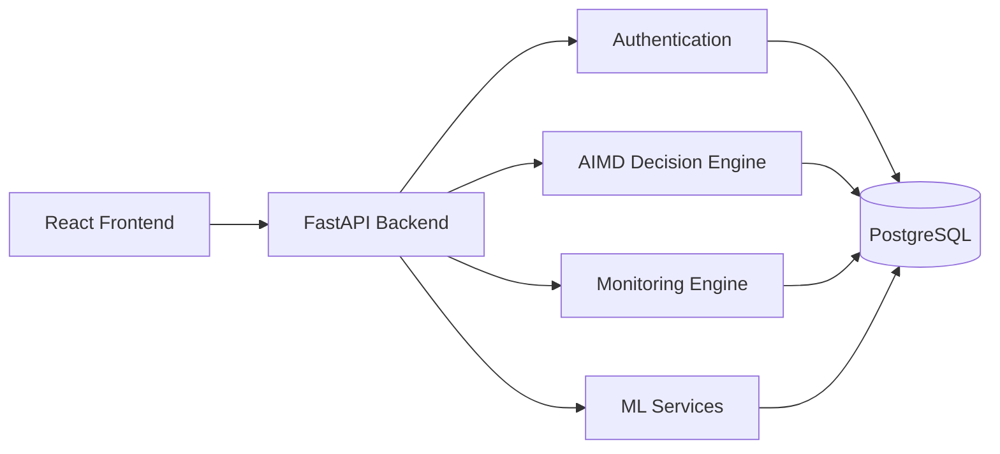
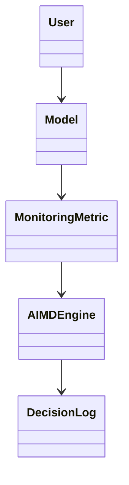
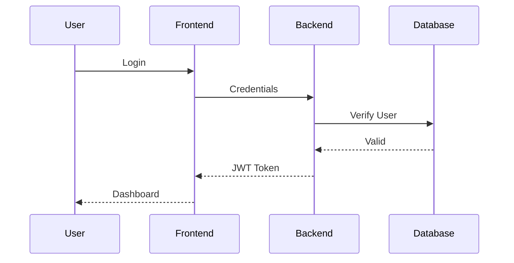

# Software Design Document (SDD)

**Project:** PhoenixML

**Version:** 1.0

**Prepared By:** Shailendra Singh Rathore

---

# 1. Introduction

## 1.1 Purpose

This Software Design Document (SDD) describes the internal design and implementation of PhoenixML. It translates the requirements defined in the Software Requirements Specification (SRS) into a modular software architecture that guides development.

The document defines system modules, component interactions, database organization, API communication, and design principles used throughout the project.

---

# 2. Design Goals

The software is designed with the following goals:

- Modular architecture
- High maintainability
- Explainable decision making
- Scalability
- Separation of concerns
- Secure communication
- Easy future extension

---

# 3. Overall Design



---

# 4. Project Structure

```
PhoenixML/

backend/

frontend/

docs/

docker/

tests/

scripts/

README.md
```

---

# 5. Backend Design

```
backend/

├── api/
├── auth/
├── core/
├── database/
├── models/
├── schemas/
├── services/
├── decision_engine/
├── monitoring/
├── ml/
├── utils/
└── main.py
```

---

## Module Responsibilities

### api/

REST API endpoints.

---

### auth/

- JWT
- Login
- Registration
- Authorization

---

### database/

- Database connection
- Session management
- Migrations

---

### models/

SQLAlchemy ORM models.

---

### schemas/

Pydantic request/response models.

---

### services/

Business logic.

---

### decision_engine/

Implementation of AIMD.

---

### monitoring/

Monitoring metric collection.

---

### ml/

Machine Learning utilities.

---

### utils/

Shared helper functions.

---

# 6. Frontend Design

```
frontend/

src/

components/

pages/

services/

hooks/

contexts/

assets/

utils/

App.tsx
```

---

## Main Pages

- Login
- Dashboard
- Models
- Monitoring
- Recommendations
- Decision Logs
- Settings

---

# 7. Component Design

## Authentication Module

Responsibilities

- Register users
- Login users
- Generate JWT
- Validate JWT

---

## Model Management Module

Responsibilities

- Register model
- Update model
- Delete model
- View model

---

## Monitoring Module

Responsibilities

- Store monitoring metrics
- Calculate drift
- Track health

---

## AIMD Module

Responsibilities

- Normalize metrics
- Calculate health score
- Evaluate context
- Generate recommendation
- Generate explanation

---

## Dashboard Module

Responsibilities

- Display statistics
- Show recommendations
- Visualize monitoring data

---

# 8. Class Design



---

# 9. Database Design

Main Tables

- users
- models
- model_versions
- monitoring_metrics
- decision_logs
- training_runs

---

# 10. API Design

REST communication.

```
React

↓

FastAPI

↓

Business Logic

↓

Database
```

---

# 11. Authentication Flow



---

# 12. AIMD Design

```mermaid
flowchart TD

Metrics

↓

Normalize

↓

Health Score

↓

Context Evaluation

↓

Decision Matrix

↓

Recommendation

↓

Explanation
```

---

## AIMD Algorithm

1. Collect monitoring metrics.
2. Normalize values.
3. Calculate health score.
4. Evaluate operational context.
5. Determine recommendation.
6. Generate explanation.
7. Store decision log.
8. Return response.

---

# 13. Error Handling

The system shall handle:

- Invalid authentication
- Missing data
- Database failure
- API exceptions
- Invalid requests

Standard JSON error responses shall be returned.

---

# 14. Logging

Logs include:

- User activity
- Authentication
- API requests
- Monitoring events
- AIMD decisions
- System errors

---

# 15. Configuration

Configuration values include:

- Database URL
- JWT Secret
- Token Expiry
- Health Score Weights
- Drift Threshold
- Logging Level

Configuration will be stored in environment variables.

---

# 16. Design Patterns

PhoenixML uses:

- Layered Architecture
- Repository Pattern
- Dependency Injection
- Service Layer
- Factory Pattern (future)

---

# 17. Security Design

Security measures include:

- JWT Authentication
- Password hashing
- Input validation
- SQL injection prevention
- HTTPS deployment
- Role-based authorization

---

# 18. Future Design Improvements

Future versions may introduce:

- Microservices
- Kubernetes
- Event-driven architecture
- Message queues
- Reinforcement Learning policy engine

---

# 19. Conclusion

The Software Design Document defines the internal architecture of PhoenixML. By separating responsibilities into independent modules, the design supports maintainability, scalability, and explainable decision making. The AIMD Framework remains the central component, coordinating monitoring data and generating transparent maintenance recommendations while integrating with existing MLOps workflows.