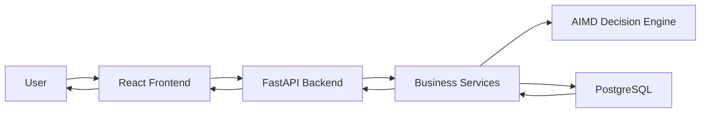
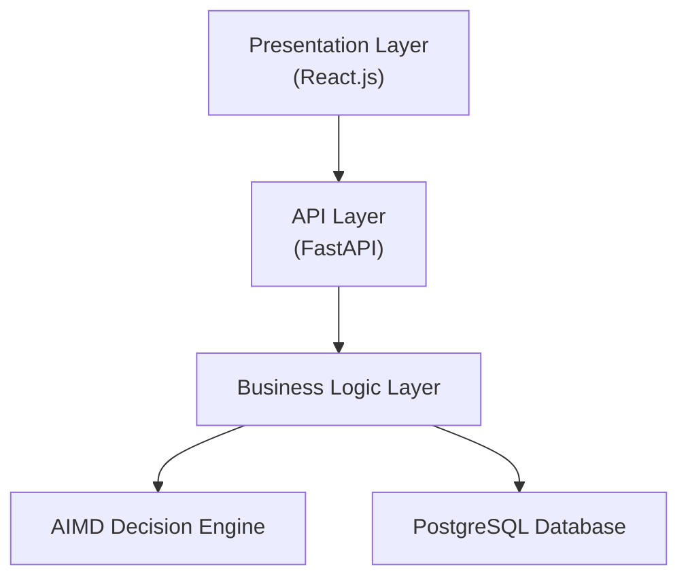
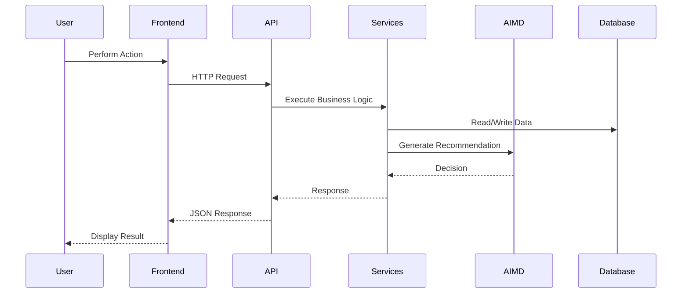
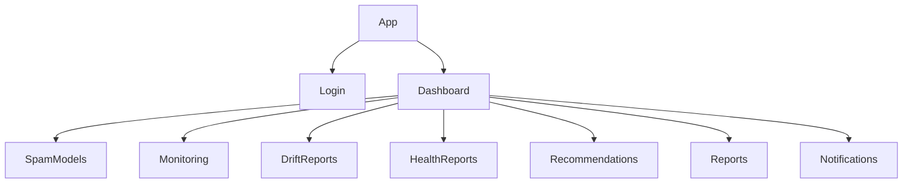
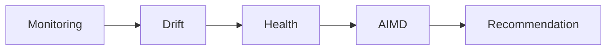
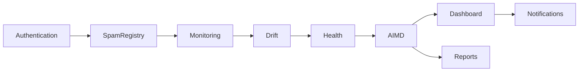
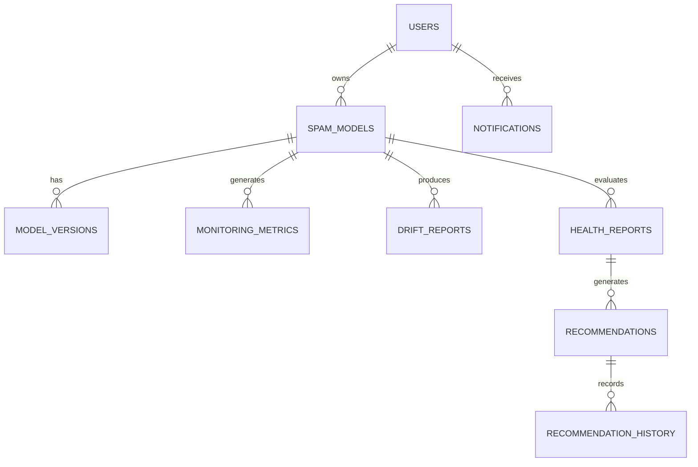
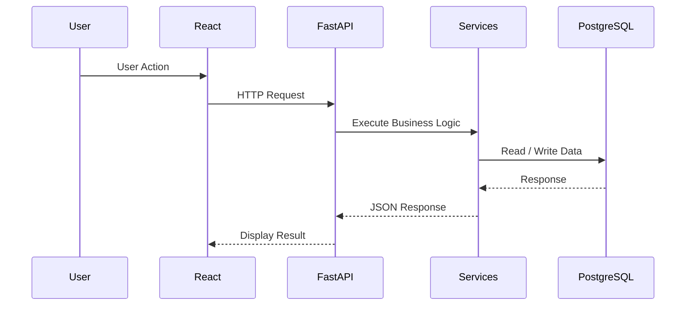

# Software Design Document

**Project:** PhoenixML – An Intelligent MLOps Decision Support Framework for Spam Email Detection

**Version:** 2.0

**Prepared By:** Shailendra Singh Rathore

**Document Type:** Software Design Document (SDD)

---

# Revision History

| Version | Date | Author | Description |
|---------|------|--------|-------------|
| 1.0 | XX/XX/2026 | Shailendra Singh Rathore | Initial Software Design Document |
| 2.0 | XX/XX/2026 | Shailendra Singh Rathore | Redesigned architecture aligned with PhoenixML v2.0 |

---

# Table of Contents

1. Introduction
2. Design Objectives
3. Scope
4. Technology Stack
5. High-Level System Overview

---

# 1. Introduction

## 1.1 Purpose

This Software Design Document (SDD) describes the internal architecture and design of **PhoenixML – An Intelligent MLOps Decision Support Framework for Spam Email Detection**.

The document translates the functional and non-functional requirements defined in the Software Requirements Specification (SRS) into a structured software design. It explains how the system is organized into modules, how these modules communicate, and how major design decisions support maintainability, scalability, and future enhancements.

This document serves as a blueprint for developers during implementation and provides a clear understanding of the overall system architecture.

---

## 1.2 Scope

The design presented in this document covers all major software components of PhoenixML, including:

- User Authentication
- Spam Model Registry
- Production Monitoring
- Drift Detection
- Health Assessment
- Adaptive Intelligent Model Decision (AIMD) Engine
- Reporting
- Dashboard
- Notification Management

Detailed database schema and REST API specifications are documented separately in the **Database Design Document** and **API Design Document**.

---

# 2. Design Objectives

The architecture of PhoenixML has been designed with the following objectives:

### Maintainability

The system is organized into independent modules so that new features or modifications can be introduced with minimal impact on existing components.

### Scalability

The architecture supports the addition of multiple models, users, and monitoring records while maintaining system performance.

### Modularity

Each module performs a specific responsibility, improving readability, testing, and maintenance.

### Security

Authentication, authorization, and secure communication mechanisms are integrated throughout the system to protect sensitive information.

### Extensibility

The design allows future integration of additional MLOps capabilities such as automated retraining, MLflow integration, and support for domains beyond spam email detection.

---

# 3. Technology Stack

PhoenixML is implemented using modern web and machine learning technologies.

| Layer | Technology |
|--------|------------|
| Frontend | React.js |
| Backend | FastAPI |
| Programming Language | Python |
| Database | PostgreSQL |
| ORM | SQLAlchemy |
| Database Migration | Alembic |
| Authentication | JWT |
| ML Libraries | Scikit-learn, Pandas, NumPy |
| API Communication | REST (JSON) |
| Version Control | Git & GitHub |

The selected technologies provide strong community support, high performance, and seamless integration for building a modern MLOps application.

---

# 4. High-Level System Overview

PhoenixML follows a layered architecture that separates the presentation, business logic, and data persistence layers. This separation improves maintainability, simplifies testing, and promotes code reuse.

The workflow begins when a user interacts with the React-based frontend. Client requests are sent to the FastAPI backend through RESTful APIs. The backend processes the request, executes the required business logic, communicates with the AIMD engine when maintenance decisions are needed, and stores or retrieves information from the PostgreSQL database using SQLAlchemy ORM.



The layered architecture isolates business logic from presentation and persistence concerns, making the system easier to maintain and extend.

---

# 5. Design Philosophy

The design of PhoenixML is guided by standard software engineering principles.

- **Separation of Concerns:** Presentation, business logic, and data management are implemented as independent layers.

- **Loose Coupling:** Modules communicate through clearly defined interfaces, reducing interdependencies.

- **High Cohesion:** Each module focuses on a single responsibility, improving readability and maintainability.

- **Human-in-the-Loop Decision Support:** AIMD generates maintenance recommendations, while final deployment decisions remain under user control.

These principles provide a robust foundation for future enhancements while ensuring that the current implementation remains organized and easy to manage.

# 6. Software Architecture

## 6.1 Architectural Overview

PhoenixML follows a **Layered Architecture** to separate the presentation layer, business logic, and data persistence. This architecture improves maintainability, simplifies testing, and allows individual modules to evolve independently.

The system consists of five primary layers:

- Presentation Layer
- API Layer
- Business Logic Layer
- AIMD Decision Layer
- Data Persistence Layer

Each layer communicates only with adjacent layers, reducing coupling and improving modularity.

---

## 6.2 Layered Architecture



### Layer Responsibilities

| Layer | Responsibility |
|--------|----------------|
| Presentation | User interface and interaction |
| API | Request validation and routing |
| Business Logic | Executes application workflows |
| AIMD | Generates maintenance recommendations |
| Data Persistence | Stores and retrieves application data |

---

## 6.3 Component Interaction

The interaction between major components follows a request-response workflow.



This workflow ensures a clear separation between user interaction, application logic, and decision support.

---

# 7. Project Structure

PhoenixML is organized into separate frontend and backend components to improve maintainability and simplify development.

```text
PhoenixML/

├── backend/
│   ├── api/
│   ├── auth/
│   ├── core/
│   ├── database/
│   ├── models/
│   ├── schemas/
│   ├── repositories/
│   ├── services/
│   ├── monitoring/
│   ├── drift_detection/
│   ├── health/
│   ├── aimd/
│   ├── reports/
│   └── utils/
│
├── frontend/
│   ├── src/
│   ├── components/
│   ├── pages/
│   ├── services/
│   └── assets/
│
├── docs/
├── tests/
├── datasets/
├── models/
└── docker/
```

This modular directory structure improves code organization and supports independent development of frontend and backend components.

---

# 8. Backend Design

The backend is developed using **FastAPI** and follows a layered structure that separates API routing, business logic, and database operations.

### Backend Workflow

```mermaid
flowchart LR

Request

↓

API Router

↓

Business Service

↓

Repository Layer

↓

Database
```

### Backend Responsibilities

- Authenticate users
- Manage spam detection models
- Collect monitoring metrics
- Perform drift analysis
- Evaluate model health
- Generate AIMD recommendations
- Produce reports
- Handle notifications

---

# 9. Frontend Design

The frontend is developed using **React.js** as a Single Page Application (SPA).

It provides an intuitive interface for managing spam detection models, monitoring production performance, reviewing AIMD recommendations, and viewing reports.

### Frontend Modules

- Authentication
- Dashboard
- Spam Model Management
- Monitoring
- Drift Reports
- Health Reports
- Recommendations
- Reports
- Notifications

---

## Frontend Component Hierarchy



The frontend communicates exclusively with the FastAPI backend through REST APIs, ensuring that business logic remains centralized within the server.

# 10. Module Design

PhoenixML is divided into independent functional modules. Each module is responsible for a specific aspect of the system and collaborates with other modules through well-defined interfaces. This modular approach simplifies development, testing, and future maintenance.

---

## 10.1 Authentication Module

### Purpose

The Authentication Module manages user registration, login, and secure access to PhoenixML. It verifies user identity before allowing access to protected resources.

### Responsibilities

- Register new users
- Authenticate users
- Generate and validate JWT tokens
- Manage user roles and permissions

### Interacts With

- User Database
- API Layer

---

## 10.2 Spam Model Registry Module

### Purpose

The Spam Model Registry Module manages deployed spam email detection models. It stores model metadata and maintains version information.

### Responsibilities

- Register spam detection models
- Update model information
- Maintain deployment status
- Manage model versions

### Interacts With

- Monitoring Module
- Database Layer

---

## 10.3 Monitoring Module

### Purpose

The Monitoring Module continuously collects runtime metrics from deployed spam detection models. These metrics are used to evaluate model performance and detect potential degradation.

### Responsibilities

- Collect production metrics
- Store monitoring history
- Trigger drift analysis
- Provide monitoring data for health evaluation

### Interacts With

- Spam Model Registry
- Drift Detection Module
- Database Layer

---

## 10.4 Drift Detection Module

### Purpose

The Drift Detection Module analyzes production data to identify changes that may reduce model performance. 

**Data Drift Definition:** Data drift refers to a statistically significant change in the distribution of input data/features. (Note: Concept drift—a change in the relationship between input features and the target—will be implemented in a future step, as well as Performance Drift). 

This module detects data drift automatically using statistical methods and informs downstream components without taking automatic maintenance action itself.

### Detection Methodology
- Uses the **Kolmogorov-Smirnov (KS) two-sample test** directly from `scipy.stats` to compare historical reference values with current values.
- Exposes both the **KS statistic** (magnitude of difference) and the **p-value** (statistical significance).
- Proposed Project Policy: Considers a feature statistically drifted if the `p-value < alpha`.
- A configurable `alpha` significance level is used (default `0.05`). Note that statistical significance depends on sample size and should be interpreted alongside the KS statistic.

### Configuration & Validation Handling
- **Minimum Sample Policy:** Configurable (default `2`). If either distribution contains fewer than `minimum_samples` valid observations, the KS test is bypassed, yielding `INSUFFICIENT_DATA`.
- **Invalid Value Handling:** `None`, `NaN`, and Infinite values are safely omitted rather than treated as zero.
- **Overall Drift:** Detected if at least one successfully analyzed feature indicates a drift. If zero features can be analyzed, returns `INSUFFICIENT_DATA`.

### Interacts With

- Monitoring Module
- Health Assessment Module

---

## 10.5 Concept Drift Module

### Purpose

The Concept Drift Module identifies changes in the relationship between input data and the target concept over time by comparing classification performance between a historical reference labeled window and a current labeled window.

### Definition and Distinction from Data Drift

- **Concept Drift:** Refers to changes in the relationship between input features and target labels ($P(Y|X)$), reflected by shifts in model classification behavior and performance over time. In email spam detection, attackers continually evolve phrasing, obfuscation tricks, and campaigns, causing classification boundaries to degrade. Spam categorization may also experience *virtual concept drift*, where the relative proportions of spam categories alter over time.
- **Data Drift:** Refers solely to changes in the marginal input feature distribution ($P(X)$) without reference to ground-truth labels.
- **Crucial Architectural Note:** This module implements an **observable, performance-based proxy** for concept drift, **not a mathematical proof** that the underlying conditional probability distribution $P(Y|X)$ has changed.

### Labeled-Window Methodology

The detector compares two sets of labeled observations:
1. **Reference Window:** Baseline ground-truth labels ($y_{\text{true}}$) and predictions ($y_{\text{pred}}$).
2. **Current Window:** Recent ground-truth labels ($y_{\text{true}}$) and predictions ($y_{\text{pred}}$).

### Monitored Metrics and Calculation Policy

For each labeled window, four core binary classification metrics are evaluated deterministically:
- **Accuracy:** $(TP + TN) / \text{Total}$
- **Precision:** $TP / (TP + FP)$ (returns `None` if $TP + FP = 0$; no positive predictions)
- **Recall:** $TP / (TP + FN)$ (returns `None` if $TP + FN = 0$; no positive ground-truth instances)
- **F1-Score:** $2 \cdot \frac{\text{Precision} \cdot \text{Recall}}{\text{Precision} + \text{Recall}}$ (returns `0.0` if Precision + Recall == 0; returns `None` if either component is undefined)

Undefined metric values are represented explicitly as `None`, preventing misleading zero values from distorting drift signals.

### Drift Signal and Degradation Threshold

For each monitored metric:
$$\Delta_{\text{metric}} = \text{Metric}_{\text{current}} - \text{Metric}_{\text{reference}}$$

Degradation is evaluated against a configurable threshold ($\text{threshold} = 0.05$ by default, identical to the project monitoring policy):
- $\Delta_{\text{metric}} \le -\text{threshold}$ $\rightarrow$ **Degraded** (`degraded = True`)
- $\Delta_{\text{metric}} > -\text{threshold}$ $\rightarrow$ **Not Degraded** (`degraded = False`)

A concept drift signal is triggered (`status = DRIFTED`, `drift_detected = True`) when **at least one** monitored metric exhibits degradation beyond the configured threshold, provided sufficient labeled data is available. The exact set of degraded metrics is exposed in `drifted_metrics` (e.g., `["f1_score", "recall"]`).

### Sample Size and Validation Policy

- **Minimum Sample Size:** Configurable via `minimum_samples` (default: 2, must be $\ge 2$). If either window has fewer valid pairs than `minimum_samples`, the detector returns `status = INSUFFICIENT_DATA`, `drift_detected = None`.
- **Validation Handling:** Mismatched $y_{\text{true}}$ and $y_{\text{pred}}$ lengths immediately raise a `ValueError`. Invalid values (`None`, `NaN`, infinite values, or unrecognized labels) are safely omitted rather than silently coerced.
- **Configurable Binary Labels:** Generic binary labels (`positive_class`, `negative_class`, default 1 and 0) allow reuse across arbitrary binary classifiers without hardcoding domain labels.

### Key Distinctions and Boundaries

- **Distinction from PerformanceAnalyzer:** `PerformanceAnalyzer` examines chronological trends across successive `MonitoringObservation` database records over time. `ConceptDriftDetector` performs window-to-window performance comparison across labeled ground-truth sets.
- **Distinction from DataDriftDetector:** `DataDriftDetector` computes the Kolmogorov-Smirnov (KS) statistic on continuous input feature distributions without requiring ground truth. `ConceptDriftDetector` specifically evaluates performance degradation on labeled outcomes.
- **Human-in-the-Loop:** The detector is an analytical decision-support signal only. It takes **no automatic maintenance actions** (no autonomous retraining, deployment, rollback, or alerting). Final decisions remain under authorized human control.

### Limitations of Performance-Based Detection

1. **Ground-Truth Label Latency:** Production spam labels often arrive with delay (user reporting, manual triage), meaning concept drift signals reflect latency in label acquisition.
2. **Proxy Representation:** A drop in performance indicates that the model's learned mapping is no longer optimal, but cannot isolate whether the shift is pure concept drift ($P(Y|X)$), covariate shift with model inadequacy, or virtual drift.
3. **Sample Sensitivity:** Small labeled sample sizes reduce statistical power; hence, the explicit `INSUFFICIENT_DATA` status ensures low-confidence windows are not prematurely classified as drifted or stable.

### Interacts With
- Pure analytical component: does not depend on FastAPI, SQLAlchemy, or MonitoringService.
- Downstream consumer: Future Adaptive Intelligent Model Decision (AIMD) engine.

---

## 10.6 Health Assessment Module

### Purpose

The Health Assessment Module evaluates the operational condition of each deployed spam detection model using monitoring metrics and drift analysis results.

### Responsibilities

- Calculate health score (using normalized metrics and configurable weights)
- Assign health status (Healthy, Warning, Critical, Insufficient Data)
- Generate health reports
- Provide input to AIMD

### Proposed PhoenixML Health Score Policy

*Note: The explicit score distribution below is a newly introduced project design policy tailored for Spam Detection, rather than an original synopsis requirement.*

- **Metric Weights:** F1-Score (0.40), Precision (0.25), Recall (0.25), Accuracy (0.10).
- **Normalization:** `metric * 100` resulting in a `0-100` score.
- **Handling Missing Metrics:** Redistribute weights proportionally among available metrics. If none exist, return `INSUFFICIENT_DATA`.
- **Thresholds (Configurable):** Healthy (80-100), Warning (60-79.9), Critical (0-59.9).

### Interacts With

- Monitoring Module
- Drift Detection Module
- AIMD Engine

---

## 10.7 Performance Analysis Module

### Purpose

The Performance Analysis Module is an independent computation layer responsible for calculating chronological performance trends across historical `MonitoringObservation` records. It operates purely on domain logic and does not query the database directly. 

**IMPORTANT DISTINCTION:**
- **NOT Health Score:** While a Health Score evaluates the current momentary condition of a model using weighted metrics, the Performance Trend evaluates how those metrics are changing over time.
- **NOT Drift Detection:** It does not analyze feature distribution changes or prediction probability drift. It only calculates mathematical trends across collected historical monitoring evaluation points (accuracy, precision, recall, f1_score).
- **NOT AIMD:** It does not produce maintenance recommendations. It is merely an analytical component whose outputs can later be consumed by an AIMD engine.

### Supported Metrics Analyzed
- Accuracy
- Precision
- Recall
- F1 Score

### Trend Calculation and Configurable Degradation Policy
Observations are sorted chronologically by `observed_at`. The module calculates an absolute change (`latest - earliest`) and a safe percentage change. 

The threshold for distinguishing degradation from a stable fluctuation is governed by a configurable degradation policy (defaulting to an absolute decrease of at least `0.05`, i.e., 5 percentage points):
- `Change <= -0.05` → DEGRADED
- `Change >= 0.05` → IMPROVING
- `-0.05 < Change < 0.05` → STABLE

### Handling of Missing Data
- Any metrics that are missing (`None`), `NaN`, or infinite at either boundary of the time window are safely omitted from calculation.
- Missing metrics are NOT treated as zero.
- Empty time windows or identical timestamps correctly yield an `INSUFFICIENT_DATA` overall status without crashing.
- Division by zero during percentage calculations (if earliest value is precisely `0.0`) is natively caught and set to `None`.

---

## 10.8 AIMD Decision Engine

### Purpose

The Adaptive Intelligent Model Decision (AIMD) Engine analyzes the health of deployed models and generates maintenance recommendations to assist ML engineers.

The current implementation uses a rule-based decision policy while allowing future integration of more advanced decision-making techniques.

### Responsibilities

- Analyze model health
- Generate maintenance recommendations
- Assign recommendation priority
- Provide decision explanations

### Recommendation Workflow



---

## 10.9 Dashboard Module

### Purpose

The Dashboard Module presents a consolidated overview of system activity and model performance.

### Responsibilities

- Display registered models
- Display monitoring statistics
- Display health summaries
- Display drift status
- Display active recommendations

### Interacts With

- All backend services through API Layer

---

## 10.10 Reporting Module

### Purpose

The Reporting Module generates reports that summarize monitoring results, drift evaluations, health status, and maintenance recommendations.

### Responsibilities

- Generate model health reports
- Export monitoring data
- Maintain report history

### Interacts With

- Database Layer
- API Layer

---

## 10.11 Notification Module

### Purpose

The Notification Module informs users about significant events that require attention.

### Responsibilities

- Generate alerts
- Store notifications
- Track notification status

Examples include:

- High drift detected
- Critical model health
- Recommendation generated
- System notifications

---

# 11. Module Interaction

The following diagram illustrates the interaction between the major functional modules.



The modular design ensures that each component performs a clearly defined responsibility while collaborating efficiently with related modules. This structure improves maintainability, simplifies testing, and supports future expansion of the PhoenixML framework.

# 12. Database Design Overview

## 12.1 Overview

PhoenixML uses **PostgreSQL** as its primary relational database and **SQLAlchemy ORM** for database interaction. The database is designed to store application data reliably while maintaining integrity, consistency, and efficient retrieval.

The database supports all major system modules, including authentication, spam model management, production monitoring, drift analysis, health assessment, AIMD recommendations, and notifications.

Detailed schema definitions, table specifications, constraints, indexes, and normalization are documented separately in the **Database Design Document**.

---

## 12.2 Core Database Entities

The primary entities maintained by PhoenixML are:

- Users
- Spam Models
- Model Versions
- Monitoring Metrics
- Drift Reports
- Health Reports
- Recommendations
- Recommendation History
- Notifications

These entities collectively support the complete lifecycle of deployed spam detection models.

---

## 12.3 Entity Relationship Overview



---

# 13. API Design Overview

## 13.1 Overview

PhoenixML exposes RESTful APIs through **FastAPI** to enable communication between the React frontend and the backend services.

The API layer validates incoming requests, invokes business logic, interacts with the database, and returns standardized JSON responses to the client.

Detailed endpoint specifications, request/response formats, authentication requirements, and status codes are documented in the **API Design Document**.

---

## 13.2 Functional API Groups

The APIs are organized into the following functional groups:

| API Group | Purpose |
|-----------|---------|
| Authentication | User registration and login |
| Spam Models | Manage deployed models |
| Monitoring | Store and retrieve monitoring metrics |
| Drift Reports | Access drift analysis results |
| Health Reports | Retrieve model health information |
| Recommendations | Generate and manage AIMD recommendations |
| Dashboard | Display system overview |
| Reports | Generate monitoring reports |
| Notifications | Manage user alerts |

---

## 13.3 API Communication Flow



---

# 14. Security Design

## 14.1 Security Overview

Security is incorporated throughout PhoenixML to protect user accounts, model information, and monitoring data.

The system implements authentication, authorization, input validation, and secure communication to ensure that only authorized users can access protected resources.

---

## 14.2 Authentication

PhoenixML uses **JSON Web Tokens (JWT)** for user authentication.

After successful login, users receive an access token that must accompany requests to protected API endpoints.

---

## 14.3 Authorization

Access to system resources is controlled using **Role-Based Access Control (RBAC)**.

Supported roles include:

- Administrator
- ML Engineer
- Viewer

Each role is granted permissions appropriate to its responsibilities.

---

## 14.4 Input Validation

All client requests are validated before processing.

Validation includes:

- Required fields
- Data types
- Value ranges
- Input formats

Invalid requests return standardized error responses without exposing internal implementation details.

---

# 15. Logging and Configuration

## 15.1 Logging

PhoenixML records important system events to support monitoring, debugging, and auditing.

Examples include:

- User authentication
- Model registration
- Monitoring execution
- Drift detection
- AIMD recommendation generation
- System errors

---

## 15.2 Configuration

Application settings are managed using environment variables.

Configuration categories include:

- Database connection
- JWT settings
- Logging configuration
- Monitoring thresholds
- Drift thresholds

This approach simplifies deployment across development, testing, and production environments.

# 16. Design Patterns

PhoenixML incorporates well-established software engineering design patterns to improve code organization, maintainability, and future extensibility.

## 16.1 Layered Architecture

The system follows a layered architecture that separates the presentation, business logic, and data persistence layers. This separation improves maintainability and simplifies testing by assigning each layer a distinct responsibility.

---

## 16.2 Repository Pattern

The Repository Pattern abstracts database operations from business logic. Instead of interacting directly with the database, service modules access data through repository classes, making the code easier to maintain and test.

---

## 16.3 Service Layer Pattern

Business rules and application workflows are implemented within service classes. This approach keeps API controllers lightweight and separates request handling from business logic.

---

## 16.4 Dependency Injection

FastAPI's dependency injection mechanism is used to provide services such as database sessions, authentication, and repositories. This reduces coupling between components and improves testability.

---

## 16.5 Future Design Extensions

The architecture has been designed to support future enhancements with minimal structural changes. Possible extensions include:

- Automatic model retraining
- Champion–Challenger model evaluation
- MLflow integration
- Multi-model monitoring
- Support for additional machine learning domains
- Docker and Kubernetes deployment

---

# 17. Advantages of the Proposed Design

The proposed architecture offers several benefits:

- Modular and easy-to-maintain software structure.
- Clear separation between presentation, business logic, and data layers.
- Scalable architecture suitable for future enhancements.
- Secure authentication and authorization mechanisms.
- Independent modules that simplify testing and maintenance.
- Support for intelligent maintenance of deployed spam detection models through the AIMD framework.

These characteristics make PhoenixML suitable for both academic implementation and future real-world expansion.

---

# 18. Conclusion

This Software Design Document presents the architectural design of **PhoenixML – An Intelligent MLOps Decision Support Framework for Spam Email Detection**.

The system is organized into modular components responsible for authentication, spam model management, monitoring, drift detection, health assessment, recommendation generation, reporting, and notifications. A layered architecture, combined with modern technologies such as React, FastAPI, PostgreSQL, and SQLAlchemy, provides a scalable and maintainable foundation for the application.

The design supports the complete lifecycle of deployed spam detection models by enabling continuous monitoring, intelligent maintenance recommendations, and human-assisted decision making. Its modular structure also allows future enhancements without requiring major architectural changes.

---

# References

1. IEEE Std 1016-2009 – IEEE Standard for Software Design Descriptions
2. ISO/IEC/IEEE 12207 – Systems and Software Engineering
3. FastAPI Documentation
4. PostgreSQL Documentation
5. SQLAlchemy Documentation
6. React Documentation
7. Scikit-learn Documentation