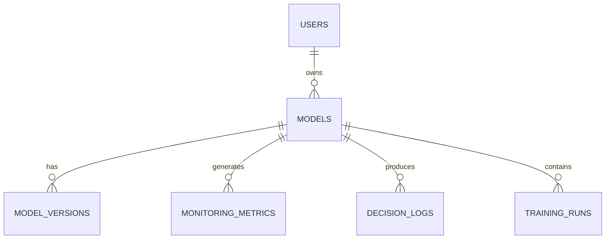
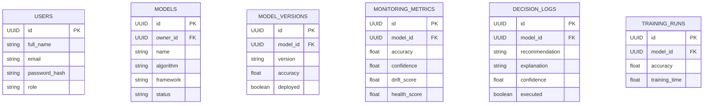

# Database Design

**Project:** PhoenixML

**Version:** 1.0

**Prepared By:** Shailendra Singh Rathore

---

# 1. Introduction

This document describes the database design of PhoenixML. The database stores user information, registered machine learning models, monitoring metrics, AIMD recommendations, decision history, and model versions.

The design follows normalization principles to reduce redundancy while maintaining efficient query performance.

---

# 2. Database Technology

| Property | Value |
|----------|-------|
| Database | PostgreSQL |
| ORM | SQLAlchemy |
| Migration Tool | Alembic |
| Primary Key | UUID |
| Timestamp | UTC |

---

# 3. Database Overview



---

# 4. Entity Descriptions

## 4.1 Users

Stores user accounts.

| Column | Type |
|---------|------|
| id | UUID |
| full_name | VARCHAR(100) |
| email | VARCHAR(255) |
| password_hash | TEXT |
| role | VARCHAR(30) |
| created_at | TIMESTAMP |
| updated_at | TIMESTAMP |

---

## 4.2 Models

Stores registered ML models.

| Column | Type |
|---------|------|
| id | UUID |
| owner_id | UUID |
| name | VARCHAR(150) |
| description | TEXT |
| algorithm | VARCHAR(100) |
| framework | VARCHAR(100) |
| status | VARCHAR(30) |
| created_at | TIMESTAMP |

---

## 4.3 Model Versions

Stores version history.

| Column | Type |
|---------|------|
| id | UUID |
| model_id | UUID |
| version | VARCHAR(20) |
| accuracy | DECIMAL |
| deployed | BOOLEAN |
| created_at | TIMESTAMP |

---

## 4.4 Monitoring Metrics

Stores production monitoring data.

| Column | Type |
|---------|------|
| id | UUID |
| model_id | UUID |
| accuracy | FLOAT |
| confidence | FLOAT |
| drift_score | FLOAT |
| data_quality | FLOAT |
| latency | FLOAT |
| cpu_usage | FLOAT |
| memory_usage | FLOAT |
| health_score | FLOAT |
| created_at | TIMESTAMP |

---

## 4.5 Decision Logs

Stores recommendations generated by AIMD.

| Column | Type |
|---------|------|
| id | UUID |
| model_id | UUID |
| recommendation | VARCHAR(100) |
| explanation | TEXT |
| confidence | FLOAT |
| health_score | FLOAT |
| executed | BOOLEAN |
| approved_by | UUID |
| created_at | TIMESTAMP |

---

## 4.6 Training Runs

Stores retraining history.

| Column | Type |
|---------|------|
| id | UUID |
| model_id | UUID |
| dataset | VARCHAR(255) |
| accuracy | FLOAT |
| training_time | FLOAT |
| completed | BOOLEAN |
| created_at | TIMESTAMP |

---

# 5. Relationships

```text
User
 │
 └── Models
         │
         ├── Model Versions
         │
         ├── Monitoring Metrics
         │
         ├── Decision Logs
         │
         └── Training Runs
```

---

# 6. Normalization

The database follows Third Normal Form (3NF):

- Elimination of duplicate data
- Separate entities for models and versions
- Independent monitoring records
- Separate decision history
- Foreign key relationships

---

# 7. Indexing Strategy

Indexes should be created for:

| Table | Columns |
|--------|----------|
| Users | email |
| Models | owner_id |
| Models | name |
| Monitoring Metrics | model_id |
| Monitoring Metrics | created_at |
| Decision Logs | model_id |
| Decision Logs | created_at |

---

# 8. Constraints

## Users

- Email must be unique.
- Password cannot be null.

## Models

- Owner must exist.
- Name cannot be empty.

## Monitoring Metrics

- Health score must be between 0 and 100.
- Drift score must be between 0 and 100.

## Decision Logs

- Recommendation cannot be null.

---

# 9. Sample ER Diagram



---

# 10. Future Enhancements

Possible future tables include:

- Alert Rules
- Notification History
- Audit Logs
- Deployment History
- Dataset Registry
- Feature Store Metadata
- User Activity Logs

---

# 11. Conclusion

The PhoenixML database design provides a modular and scalable schema for managing machine learning models, monitoring metrics, maintenance recommendations, and decision history. The use of PostgreSQL with SQLAlchemy enables reliable data storage while maintaining compatibility with the AIMD Framework and future system extensions.