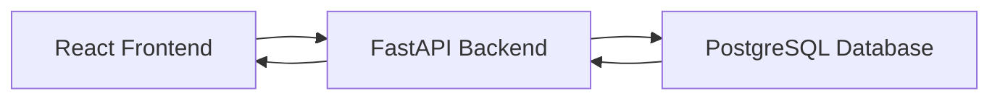
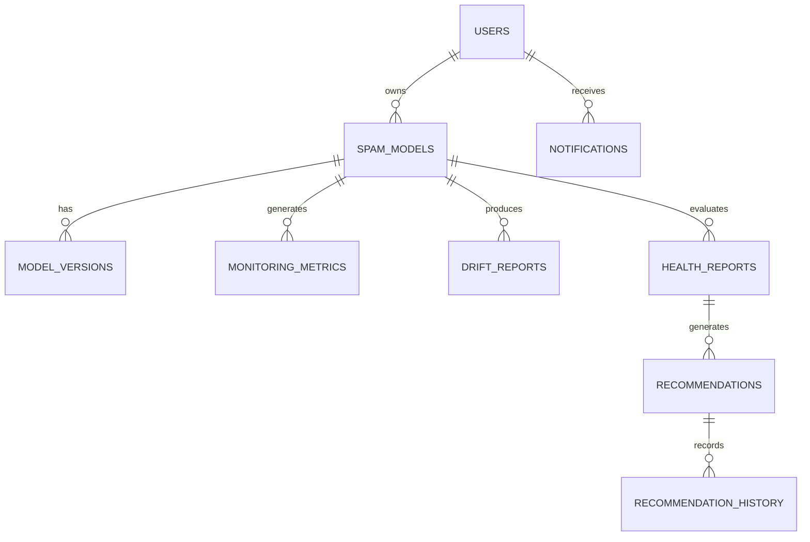
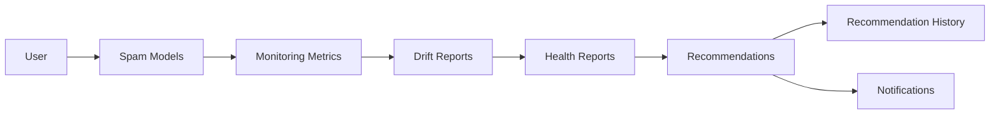

# Database Design Document

**Project:** PhoenixML – An Intelligent MLOps Decision Support Framework for Spam Email Detection

**Version:** 2.0

**Prepared By:** Shailendra Singh Rathore

**Document Type:** Database Design Document (DDD)

---

# Revision History

| Version | Date | Author | Description |
|---------|------|--------|-------------|
| 1.0 | XX/XX/2026 | Shailendra Singh Rathore | Initial Database Design Document |
| 2.0 | XX/XX/2026 | Shailendra Singh Rathore | Updated database design aligned with PhoenixML v2.0 |

---

# Table of Contents

1. Introduction
2. Database Objectives
3. Database Architecture
4. Database Management System
5. Core Database Entities

---

# 1. Introduction

## 1.1 Purpose

This Database Design Document describes the logical database structure of **PhoenixML – An Intelligent MLOps Decision Support Framework for Spam Email Detection**.

The document defines the major entities, relationships, and organizational structure required to support user management, spam model registration, production monitoring, drift detection, health assessment, recommendation management, and notifications.

The objective of this document is to provide a clear blueprint for storing and managing application data while ensuring consistency, integrity, and efficient retrieval.

---

## 1.2 Scope

The database design supports all major modules of PhoenixML, including:

- User Authentication
- Spam Model Registry
- Production Monitoring
- Drift Detection
- Health Assessment
- AIMD Recommendations
- Notification Management
- Reporting

Detailed implementation aspects such as ORM mappings and migration scripts are outside the scope of this document.

---

# 2. Database Objectives

The database has been designed with the following objectives:

### Data Integrity

Maintain accurate and consistent information through relationships and constraints.

### Reliability

Ensure secure storage and retrieval of application data.

### Scalability

Support increasing numbers of users, spam detection models, monitoring records, and reports without significant redesign.

### Maintainability

Organize data into logical entities that simplify future modifications and extensions.

### Performance

Enable efficient querying of monitoring metrics, drift reports, health assessments, and recommendation history.

---

# 3. Database Architecture

PhoenixML uses a centralized relational database architecture.

All application modules communicate with a single PostgreSQL database through the backend service layer. The backend validates requests, applies business rules, and performs database operations using SQLAlchemy ORM.

This architecture ensures centralized data management while keeping database access isolated within the backend.

---

# 4. Database Management System

PhoenixML uses **PostgreSQL** as its relational database management system.

PostgreSQL was selected because it provides:

- ACID-compliant transactions
- Strong data integrity
- Efficient indexing
- Support for complex relationships
- Excellent scalability
- Wide community support

The backend communicates with PostgreSQL through SQLAlchemy ORM, allowing developers to interact with database objects using Python while preserving relational database capabilities.

---

# 5. Core Database Entities

The PhoenixML database is organized around the following primary entities:

| Entity | Purpose |
|---------|---------|
| Users | Stores user accounts and authentication details |
| Spam Models | Stores deployed spam detection model information |
| Model Versions | Maintains version history of registered models |
| Monitoring Metrics | Stores runtime performance metrics |
| Drift Reports | Stores data and concept drift analysis results |
| Health Reports | Stores model health evaluation results |
| Recommendations | Stores AIMD-generated maintenance recommendations |
| Recommendation History | Maintains historical recommendation records |
| Notifications | Stores alerts and user notifications |

Together, these entities support the complete lifecycle of monitoring and maintaining deployed spam email detection models.

# 6. Entity Design

This section describes the primary entities that constitute the PhoenixML database. Each entity is designed to support a specific functional module while maintaining data consistency and minimizing redundancy.

---

## 6.1 Users

### Purpose

The **Users** entity stores information about registered users who access the PhoenixML system. It supports authentication, authorization, and user management.

### Key Attributes

| Attribute | Description |
|-----------|-------------|
| User ID | Unique identifier for each user |
| Full Name | User's name |
| Email | Registered email address |
| Password Hash | Encrypted user password |
| Role | User role (Administrator, ML Engineer, Viewer) |
| Created At | Account creation timestamp |

### Relationships

- One user can register multiple spam detection models.
- One user can receive multiple notifications.

---

## 6.2 Spam Models

### Purpose

The **Spam Models** entity stores metadata about deployed spam email detection models monitored by PhoenixML.

### Key Attributes

| Attribute | Description |
|-----------|-------------|
| Model ID | Unique model identifier |
| Model Name | Name of the deployed model |
| Algorithm | Classification algorithm used |
| Deployment Date | Date of deployment |
| Status | Active or Inactive |
| Owner ID | Reference to the registered user |

### Relationships

- Each model belongs to one user.
- One model can have multiple versions.
- One model can generate multiple monitoring records, drift reports, and health reports.

---

## 6.3 Model Versions

### Purpose

The **Model Versions** entity maintains version history for deployed spam detection models.

### Key Attributes

| Attribute | Description |
|-----------|-------------|
| Version ID | Unique version identifier |
| Model ID | Associated spam model |
| Version Number | Model version |
| Release Date | Deployment date of version |
| Description | Version notes |

### Relationships

- Multiple versions can belong to one spam model.

---

## 6.4 Monitoring Metrics

### Purpose

The **Monitoring Metrics** entity stores runtime performance information collected from deployed spam detection models.

### Key Attributes

| Attribute | Description |
|-----------|-------------|
| Metric ID | Unique metric identifier |
| Model ID | Associated model |
| Accuracy | Measured accuracy |
| Precision | Precision score |
| Recall | Recall score |
| F1 Score | F1 evaluation score |
| Timestamp | Time of data collection |

### Relationships

- Multiple monitoring records belong to one spam model.
- Monitoring metrics provide input for drift detection and health assessment.

---

## 6.5 Drift Reports

### Purpose

The **Drift Reports** entity stores results generated during data drift and concept drift analysis.

### Key Attributes

| Attribute | Description |
|-----------|-------------|
| Drift ID | Unique drift report identifier |
| Model ID | Associated spam model |
| Drift Type | Data Drift or Concept Drift |
| Drift Score | Calculated drift value |
| Severity | Low, Medium, or High |
| Generated At | Report generation time |

### Relationships

- Each drift report belongs to one spam model.
- Drift reports are used during health assessment.

---

## 6.6 Health Reports

### Purpose

The **Health Reports** entity stores the operational health evaluation of deployed spam detection models.

### Key Attributes

| Attribute | Description |
|-----------|-------------|
| Health ID | Unique health report identifier |
| Model ID | Associated spam model |
| Health Score | Overall model health score |
| Status | Healthy, Warning, or Critical |
| Generated At | Evaluation timestamp |

### Relationships

- Each health report belongs to one spam model.
- Health reports are used by the AIMD engine to generate recommendations.

---

## 6.7 Recommendations

### Purpose

The **Recommendations** entity stores maintenance recommendations generated by the AIMD decision engine.

### Key Attributes

| Attribute | Description |
|-----------|-------------|
| Recommendation ID | Unique recommendation identifier |
| Health ID | Associated health report |
| Recommendation Type | Suggested maintenance action |
| Priority | Low, Medium, High |
| Status | Pending, Approved, Rejected |
| Generated At | Recommendation timestamp |

### Relationships

- One health report can generate multiple recommendations.
- Recommendations are recorded in recommendation history after review.

---

## 6.8 Recommendation History

### Purpose

The **Recommendation History** entity maintains historical records of recommendations and user decisions.

### Key Attributes

| Attribute | Description |
|-----------|-------------|
| History ID | Unique history identifier |
| Recommendation ID | Associated recommendation |
| Decision | Approved or Rejected |
| Reviewed By | User who reviewed the recommendation |
| Review Date | Decision timestamp |

### Relationships

- Each history record belongs to one recommendation.

---

## 6.9 Notifications

### Purpose

The **Notifications** entity stores alerts and system notifications generated during monitoring and maintenance activities.

### Key Attributes

| Attribute | Description |
|-----------|-------------|
| Notification ID | Unique notification identifier |
| User ID | Recipient |
| Message | Notification content |
| Status | Read or Unread |
| Created At | Notification timestamp |

### Relationships

- Multiple notifications can belong to one user.

---

# 7. Entity Relationship Diagram

The relationships among the primary entities are illustrated below.

The Entity Relationship Diagram illustrates how data flows through the PhoenixML framework, from user and model management to monitoring, health evaluation, recommendation generation, and notification delivery. The design ensures data consistency while supporting efficient retrieval and future scalability.

# 8. Table Specifications

This section presents the logical structure of the primary database tables used in PhoenixML. Each table is designed to support a specific module while maintaining referential integrity and minimizing redundancy.

---

## 8.1 Users Table

| Column | Data Type | Constraints | Description |
|---------|-----------|------------|-------------|
| user_id | Integer | Primary Key | Unique user identifier |
| full_name | Varchar(100) | Not Null | User's full name |
| email | Varchar(100) | Unique, Not Null | Registered email address |
| password_hash | Varchar(255) | Not Null | Encrypted password |
| role | Varchar(30) | Not Null | User role |
| created_at | Timestamp | Not Null | Account creation date |

---

## 8.2 Spam Models Table

| Column | Data Type | Constraints | Description |
|---------|-----------|------------|-------------|
| model_id | Integer | Primary Key | Unique model identifier |
| model_name | Varchar(100) | Not Null | Name of the spam detection model |
| algorithm | Varchar(100) | Not Null | Machine learning algorithm |
| deployment_date | Date | Not Null | Model deployment date |
| status | Varchar(20) | Not Null | Deployment status |
| owner_id | Integer | Foreign Key | References Users table |

---

## 8.3 Model Versions Table

| Column | Data Type | Constraints | Description |
|---------|-----------|------------|-------------|
| version_id | Integer | Primary Key | Unique version identifier |
| model_id | Integer | Foreign Key | References Spam Models |
| version_number | Varchar(20) | Not Null | Version label |
| release_date | Date | Not Null | Version release date |
| description | Text | Optional | Version details |

---

## 8.4 Monitoring Metrics Table

| Column | Data Type | Constraints | Description |
|---------|-----------|------------|-------------|
| metric_id | Integer | Primary Key | Unique monitoring record |
| model_id | Integer | Foreign Key | References Spam Models |
| accuracy | Decimal | Not Null | Accuracy value |
| precision | Decimal | Not Null | Precision value |
| recall | Decimal | Not Null | Recall value |
| f1_score | Decimal | Not Null | F1-score |
| timestamp | Timestamp | Not Null | Record creation time |

---

## 8.5 Drift Reports Table

| Column | Data Type | Constraints | Description |
|---------|-----------|------------|-------------|
| drift_id | Integer | Primary Key | Unique drift report |
| model_id | Integer | Foreign Key | References Spam Models |
| drift_type | Varchar(30) | Not Null | Data Drift / Concept Drift |
| drift_score | Decimal | Not Null | Drift score |
| severity | Varchar(20) | Not Null | Drift severity |
| generated_at | Timestamp | Not Null | Report generation time |

---

## 8.6 Health Reports Table

| Column | Data Type | Constraints | Description |
|---------|-----------|------------|-------------|
| health_id | Integer | Primary Key | Unique health report |
| model_id | Integer | Foreign Key | References Spam Models |
| health_score | Decimal | Not Null | Overall health score |
| status | Varchar(20) | Not Null | Healthy, Warning, Critical |
| generated_at | Timestamp | Not Null | Evaluation timestamp |

---

## 8.7 Recommendations Table

| Column | Data Type | Constraints | Description |
|---------|-----------|------------|-------------|
| recommendation_id | Integer | Primary Key | Unique recommendation |
| health_id | Integer | Foreign Key | References Health Reports |
| recommendation_type | Varchar(100) | Not Null | Suggested action |
| priority | Varchar(20) | Not Null | Recommendation priority |
| status | Varchar(20) | Not Null | Pending, Approved, Rejected |
| generated_at | Timestamp | Not Null | Recommendation time |

---

## 8.8 Recommendation History Table

| Column | Data Type | Constraints | Description |
|---------|-----------|------------|-------------|
| history_id | Integer | Primary Key | Unique history record |
| recommendation_id | Integer | Foreign Key | References Recommendations |
| decision | Varchar(20) | Not Null | Approved or Rejected |
| reviewed_by | Integer | Foreign Key | References Users |
| review_date | Timestamp | Not Null | Decision time |

---

## 8.9 Notifications Table

| Column | Data Type | Constraints | Description |
|---------|-----------|------------|-------------|
| notification_id | Integer | Primary Key | Unique notification |
| user_id | Integer | Foreign Key | References Users |
| message | Text | Not Null | Notification message |
| status | Varchar(20) | Not Null | Read or Unread |
| created_at | Timestamp | Not Null | Notification creation time |

---

# 9. Relationship Summary

The relationships between the database tables are summarized below.

| Parent Table | Child Table | Relationship |
|--------------|-------------|--------------|
| Users | Spam Models | One-to-Many |
| Users | Notifications | One-to-Many |
| Spam Models | Model Versions | One-to-Many |
| Spam Models | Monitoring Metrics | One-to-Many |
| Spam Models | Drift Reports | One-to-Many |
| Spam Models | Health Reports | One-to-Many |
| Health Reports | Recommendations | One-to-Many |
| Recommendations | Recommendation History | One-to-Many |

These relationships maintain referential integrity and ensure that all dependent records remain logically connected throughout the lifecycle of deployed spam detection models.

# 10. Database Constraints

Database constraints are applied to maintain data accuracy, consistency, and integrity throughout the PhoenixML system.

## 10.1 Primary Key Constraints

Each table contains a primary key that uniquely identifies every record.

Examples include:

- User ID
- Model ID
- Version ID
- Metric ID
- Drift ID
- Health ID
- Recommendation ID
- History ID
- Notification ID

Primary keys prevent duplicate records and enable efficient referencing between related tables.

---

## 10.2 Foreign Key Constraints

Foreign keys establish relationships between tables and maintain referential integrity.

Examples include:

- **Owner ID** references the Users table.
- **Model ID** references the Spam Models table.
- **Health ID** references the Health Reports table.
- **Recommendation ID** references the Recommendations table.
- **User ID** references the Users table for notifications.

These constraints ensure that related records remain valid and consistent.

---

## 10.3 Unique Constraints

Unique constraints prevent duplicate values for important attributes.

Examples include:

- Email address
- Model name (per owner, if required)

This helps maintain accurate user accounts and model records.

---

## 10.4 NOT NULL Constraints

Mandatory fields are protected using NOT NULL constraints to ensure essential information is always available.

Examples include:

- User name
- Email
- Password hash
- Model name
- Health score
- Recommendation status

---

# 11. Database Normalization

The PhoenixML database is designed using normalization principles to reduce redundancy and improve data consistency.

## First Normal Form (1NF)

- Each column contains atomic values.
- Repeating groups are eliminated.
- Every record is uniquely identifiable.

---

## Second Normal Form (2NF)

- All non-key attributes depend on the entire primary key.
- Partial dependencies are removed.

---

## Third Normal Form (3NF)

- Non-key attributes depend only on the primary key.
- Transitive dependencies are eliminated.

By following Third Normal Form (3NF), the database minimizes duplication while maintaining efficient storage and retrieval.

---

# 12. Indexing Strategy

Indexes are used to improve query performance, particularly for frequently searched data.

Recommended indexes include:

| Table | Indexed Column | Purpose |
|--------|----------------|---------|
| Users | Email | Faster login and authentication |
| Spam Models | Model Name | Faster model lookup |
| Monitoring Metrics | Model ID | Efficient monitoring retrieval |
| Drift Reports | Model ID | Faster drift report access |
| Health Reports | Model ID | Faster health report retrieval |
| Recommendations | Health ID | Efficient recommendation lookup |
| Notifications | User ID | Faster notification retrieval |

Proper indexing reduces query execution time while maintaining acceptable write performance.

---

# 13. Data Integrity

PhoenixML maintains data integrity through a combination of constraints and application-level validation.

Key integrity measures include:

- Primary and foreign key enforcement
- Unique constraints
- Input validation
- Controlled update operations
- Transaction-based database operations

These measures ensure that stored information remains accurate, consistent, and reliable throughout the application's lifecycle.

---

# 14. Data Flow Overview

The following diagram illustrates how information moves through the database during system operation.

The data flow begins with user-managed spam detection models. Monitoring data is collected and analyzed for drift, followed by health assessment. The AIMD engine generates maintenance recommendations, which are reviewed, recorded in recommendation history, and may trigger notifications for users.

# 15. Advantages of the Database Design

The proposed database design provides a structured and reliable foundation for PhoenixML. By organizing data into well-defined entities and relationships, the system ensures efficient data storage, retrieval, and management.

The key advantages of the database design include:

- **Data Integrity:** Primary keys, foreign keys, and constraints ensure that data remains accurate and consistent.
- **Reduced Redundancy:** Normalization minimizes duplicate data, improving storage efficiency and reducing maintenance effort.
- **Scalability:** The schema can accommodate additional users, spam detection models, monitoring records, and recommendations as the system grows.
- **Efficient Query Performance:** Strategic indexing supports faster retrieval of frequently accessed records.
- **Maintainability:** Modular entity design simplifies future schema modifications and feature additions.
- **Support for Decision-Making:** The database effectively stores monitoring metrics, drift reports, health assessments, and AIMD recommendations, enabling informed maintenance decisions.

---

# 16. Future Enhancements

The database schema has been designed with extensibility in mind. Future improvements may include:

- Support for monitoring multiple machine learning domains beyond spam email detection.
- Storage of additional model performance metrics and evaluation statistics.
- Integration with external MLOps platforms such as MLflow.
- Enhanced audit logging for user activities and system events.
- Advanced reporting tables for analytical dashboards.
- Support for distributed or cloud-based database deployments.

These enhancements can be incorporated without significant modifications to the existing schema due to the modular structure of the database.

---

# 17. Conclusion

This Database Design Document presents the logical database architecture for **PhoenixML – An Intelligent MLOps Decision Support Framework for Spam Email Detection**.

The database is organized around a set of normalized entities that support user management, spam model registration, production monitoring, drift analysis, health assessment, AIMD recommendations, notifications, and reporting. Relationships between entities are enforced through primary and foreign keys, ensuring consistency and referential integrity.

The design emphasizes scalability, maintainability, and efficient data management, providing a robust foundation for the PhoenixML application and supporting future enhancements as the system evolves.

---

# References

1. Elmasri, R., & Navathe, S. B. *Fundamentals of Database Systems*. Pearson.
2. PostgreSQL Documentation.
3. SQLAlchemy Documentation.
4. IEEE Std 1016-2009 – IEEE Standard for Software Design Descriptions.
5. ISO/IEC/IEEE 12207 – Systems and Software Engineering.