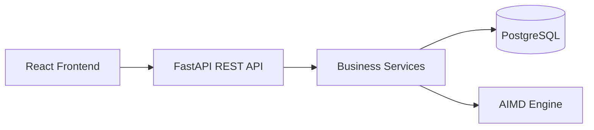
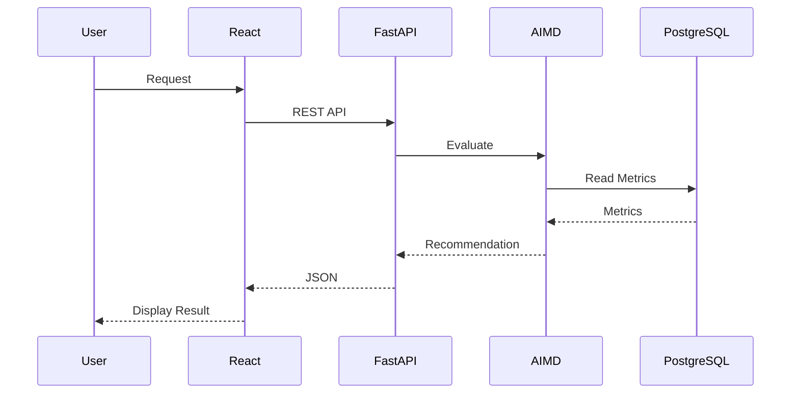

# API Design

**Project:** PhoenixML

**Version:** 1.0

**Prepared By:** Shailendra Singh Rathore

---

# 1. Introduction

This document defines the REST API specification for PhoenixML. The APIs enable communication between the React frontend, the FastAPI backend, the AIMD decision engine, and the PostgreSQL database.

The API follows REST principles and exchanges data in JSON format.

---

# 2. API Architecture



---

# 3. Authentication

Authentication uses JWT.

Protected endpoints require:

```
Authorization: Bearer <token>
```

---

# 4. Authentication APIs

## Register

POST

```
/api/v1/auth/register
```

Request

```json
{
    "full_name":"John Doe",
    "email":"john@example.com",
    "password":"password123"
}
```

Response

```json
{
    "message":"User registered successfully"
}
```

---

## Login

POST

```
/api/v1/auth/login
```

Request

```json
{
    "email":"john@example.com",
    "password":"password123"
}
```

Response

```json
{
    "access_token":"jwt_token",
    "token_type":"Bearer"
}
```

---

## Current User

GET

```
/api/v1/auth/me
```

---

# 5. Model APIs

## Register Model

POST

```
/api/v1/models
```

---

## Get All Models

GET

```
/api/v1/models
```

---

## Get Model

GET

```
/api/v1/models/{id}
```

---

## Update Model

PUT

```
/api/v1/models/{id}
```

---

## Delete Model

DELETE

```
/api/v1/models/{id}
```

---

# 6. Monitoring APIs

## Submit Metrics

POST

```
/api/v1/monitoring
```

Example

```json
{
    "model_id":"uuid",
    "accuracy":92,
    "confidence":88,
    "drift_score":12,
    "data_quality":95,
    "latency":120
}
```

---

## Get Monitoring History

GET

```
/api/v1/monitoring/{model_id}
```

---

# 7. AIMD APIs

## Evaluate Model

POST

```
/api/v1/decision/evaluate
```

Request

```json
{
    "model_id":"uuid"
}
```

Response

```json
{
    "health_score":84,
    "status":"Healthy",
    "recommended_action":"Increase Monitoring",
    "confidence":91
}
```

---

## Recommendation History

GET

```
/api/v1/decision/history/{model_id}
```

---

# 8. Dashboard APIs

## Dashboard Summary

GET

```
/api/v1/dashboard
```

Returns

- Active models
- Average health score
- Latest recommendations
- Alerts

---

# 9. Report APIs

## Generate Report

GET

```
/api/v1/reports/{model_id}
```

---

# 10. HTTP Status Codes

| Code | Meaning |
|------|---------|
|200|Success|
|201|Created|
|400|Bad Request|
|401|Unauthorized|
|403|Forbidden|
|404|Not Found|
|422|Validation Error|
|500|Internal Server Error|

---

# 11. Error Format

```json
{
    "success":false,
    "message":"Validation failed",
    "errors":[]
}
```

---

# 12. API Versioning

Current Version

```
/api/v1/
```

Future versions

```
/api/v2/
```

---

# 13. Security

The API implements:

- JWT Authentication
- Password Hashing
- Input Validation
- Role-Based Authorization
- HTTPS Support
- CORS Protection

---

# 14. API Flow



---

# 15. Future APIs

Future releases may include:

- WebSocket Notifications
- Batch Model Evaluation
- Alert Configuration
- Audit Logs
- Kubernetes Integration
- MLflow Integration APIs

---

# 16. Conclusion

The PhoenixML REST API provides a secure and modular interface for authentication, model management, monitoring, and AIMD recommendations. The API is designed to be scalable, versioned, and easy to integrate with frontend applications and future services.