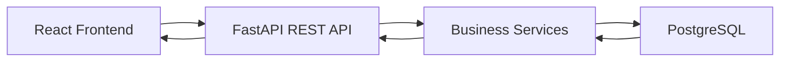
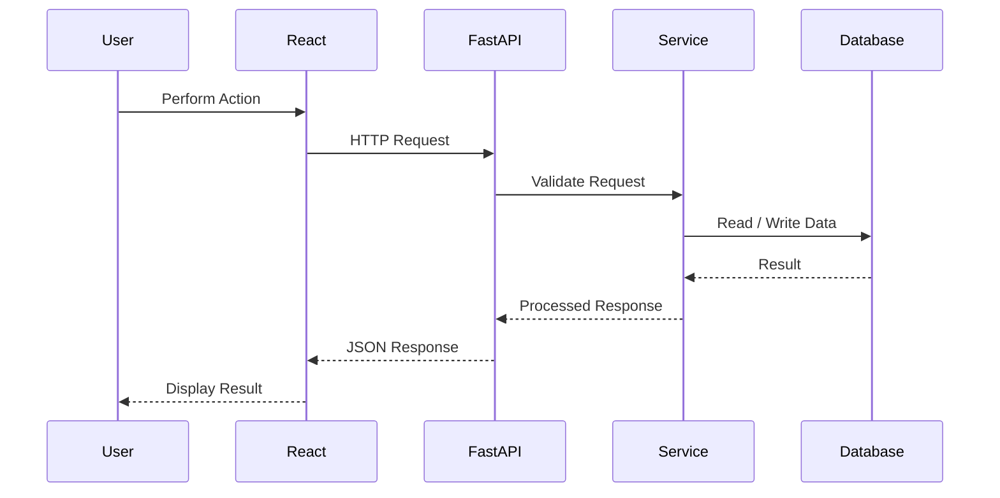
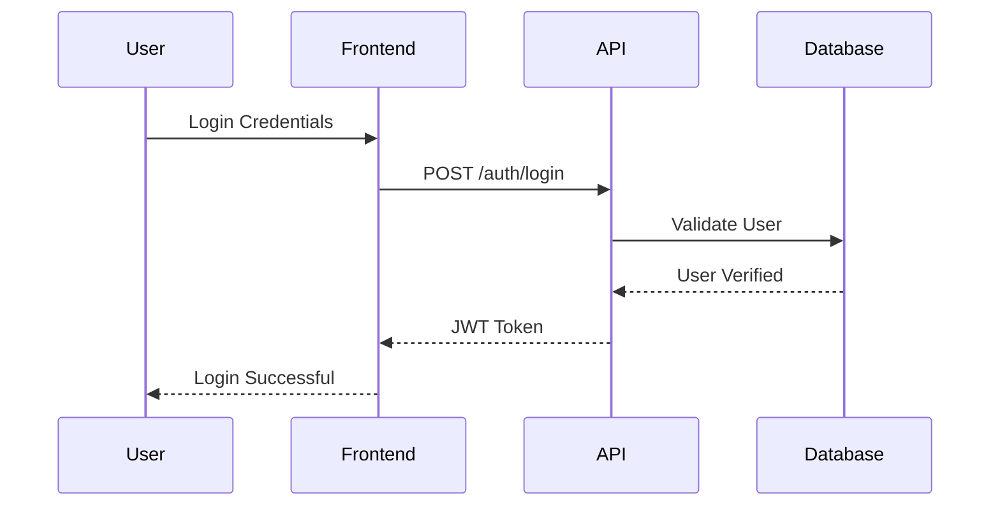

# API Design Document

**Project:** PhoenixML – An Intelligent MLOps Decision Support Framework for Spam Email Detection

**Version:** 2.0

**Prepared By:** Shailendra Singh Rathore

**Document Type:** API Design Document (ADD)

---

# Revision History

| Version | Date | Author | Description |
|---------|------|--------|-------------|
| 1.0 | XX/XX/2026 | Shailendra Singh Rathore | Initial API Design Document |
| 2.0 | XX/XX/2026 | Shailendra Singh Rathore | Updated API design aligned with PhoenixML v2.0 |

---

# Table of Contents

1. Introduction
2. API Design Objectives
3. API Architecture
4. API Standards
5. API Modules

---

# 1. Introduction

## 1.1 Purpose

This API Design Document describes the RESTful APIs used by **PhoenixML – An Intelligent MLOps Decision Support Framework for Spam Email Detection**. It defines how the frontend communicates with backend services, ensuring secure, standardized, and efficient data exchange.

The document provides a high-level overview of API organization, endpoint groups, request processing, authentication mechanisms, and response formats.

---

## 1.2 Scope

The API layer supports communication for all major modules of PhoenixML, including:

- User Authentication
- Spam Model Management
- Production Monitoring
- Drift Detection
- Health Assessment
- AIMD Recommendations
- Dashboard
- Notifications
- Reporting

Detailed backend implementation and business logic are documented separately in the Software Design Document.

---

# 2. API Design Objectives

The API has been designed with the following objectives:

### Standardization

Provide consistent request and response structures across all endpoints.

### Security

Protect system resources using JWT-based authentication and role-based authorization.

### Scalability

Support future API expansion without breaking existing client applications.

### Maintainability

Organize endpoints into logical functional groups for easier development and maintenance.

### Performance

Ensure efficient communication between the frontend and backend using lightweight JSON messages.

---

# 3. API Architecture

PhoenixML follows a client-server architecture where the React frontend communicates with the FastAPI backend through REST APIs.



The API layer acts as an intermediary between the frontend and backend services, validating requests, enforcing authentication, invoking business logic, and returning standardized responses.

---

# 4. API Standards

The PhoenixML API follows standard REST design principles.

| Standard | Description |
|----------|-------------|
| Protocol | HTTPS |
| Architecture | REST |
| Data Format | JSON |
| Authentication | JWT |
| Character Encoding | UTF-8 |
| HTTP Methods | GET, POST, PUT, DELETE |

---

## HTTP Methods

| Method | Purpose |
|---------|---------|
| GET | Retrieve resources |
| POST | Create new resources |
| PUT | Update existing resources |
| DELETE | Remove resources |

---

## Standard Response Format

### Successful Response

```json
{
  "success": true,
  "message": "Request processed successfully",
  "data": {}
}
```

### Error Response

```json
{
  "success": false,
  "message": "Resource not found",
  "error": {}
}
```

The standardized response structure simplifies frontend integration and improves consistency across all API endpoints.

---

# 5. API Modules

The PhoenixML API is organized into functional groups.

| Module | Base Endpoint | Purpose |
|---------|---------------|---------|
| Authentication | `/auth` | User login and registration |
| Users | `/users` | User profile management |
| Spam Models | `/spam-models` | Manage deployed models |
| Monitoring | `/monitoring` | Store and retrieve monitoring metrics |
| Drift Reports | `/drift-reports` | Access drift analysis |
| Health Reports | `/health-reports` | Retrieve model health |
| Recommendations | `/recommendations` | AIMD recommendations |
| Dashboard | `/dashboard` | Dashboard statistics |
| Reports | `/reports` | Generate reports |
| Notifications | `/notifications` | User notifications |

# 6. API Endpoint Specifications

This section describes the primary REST API endpoints provided by PhoenixML. The endpoints are organized into functional modules, each supporting a specific feature of the system.

---

# 6.1 Authentication API

### Purpose

The Authentication API manages user registration, login, and secure access to protected resources.

| Method | Endpoint | Description |
|---------|----------|-------------|
| POST | `/auth/register` | Register a new user |
| POST | `/auth/login` | Authenticate user and issue JWT token |
| GET | `/auth/profile` | Retrieve authenticated user profile |

---

# 6.2 Users API

### Purpose

The Users API allows authenticated users to manage their account information.

| Method | Endpoint | Description |
|---------|----------|-------------|
| GET | `/users/{id}` | Retrieve user details |
| PUT | `/users/{id}` | Update user profile |
| DELETE | `/users/{id}` | Delete user account |

---

# 6.3 Spam Models API

### Purpose

The Spam Models API manages deployed spam email detection models monitored by PhoenixML.

| Method | Endpoint | Description |
|---------|----------|-------------|
| GET | `/spam-models` | Retrieve all registered models |
| POST | `/spam-models` | Register a new model |
| GET | `/spam-models/{id}` | Retrieve model details |
| PUT | `/spam-models/{id}` | Update model information |
| DELETE | `/spam-models/{id}` | Remove a model |

---

# 6.4 Monitoring API

### Purpose

The Monitoring API stores and retrieves runtime performance metrics for deployed spam detection models.

| Method | Endpoint | Description |
|---------|----------|-------------|
| GET | `/monitoring` | Retrieve monitoring records |
| POST | `/monitoring` | Store monitoring metrics |
| GET | `/monitoring/{modelId}` | Retrieve monitoring history for a model |

---

# 6.5 Drift Reports API

### Purpose

The Drift Reports API provides access to drift detection results.

| Method | Endpoint | Description |
|---------|----------|-------------|
| GET | `/drift-reports` | Retrieve all drift reports |
| GET | `/drift-reports/{modelId}` | Retrieve drift reports for a model |

---

# 6.6 Health Reports API

### Purpose

The Health Reports API retrieves health assessment results generated for deployed models.

| Method | Endpoint | Description |
|---------|----------|-------------|
| GET | `/health-reports` | Retrieve all health reports |
| GET | `/health-reports/{modelId}` | Retrieve health reports for a model |

---

# 6.7 Decision History & Recommendations API

### Purpose

The Decision History & Recommendations API provides authenticated, role-based read access to AIMD decision recommendations and audit logs for deployed spam detection models. It exposes paginated decision history and individual decision inspection for dashboard consumption and auditing.

### Authorization & Access Control (RBAC)

- **Allowed Roles:** `ADMIN`, `ML_ENGINEER`, `VIEWER` (for read operations); `ADMIN`, `ML_ENGINEER` (for approval and evaluation operations).
- **Model Ownership:** Non-admin users (`ML_ENGINEER`, `VIEWER`) can only query decision history for models they own. Attempts to access or modify decisions of models owned by others return `403 Forbidden`.
- **Evaluation & Approval Permissions:** Only `ADMIN` and `ML_ENGINEER` (who own the target model) may update approval status or trigger model evaluations. Users with role `VIEWER` receive `403 Forbidden`.
- **Admin Privilege:** Users with role `ADMIN` have global read and execution permissions across all registered models.
- **Isolation & Integrity:** Requests specifying an invalid or nonexistent model or decision ID return `404 Not Found`. Cross-model access (querying a decision with an mismatched model ID) returns `404 Not Found`.

| Method | Endpoint | Description |
|---------|----------|-------------|
| GET | `/spam-models/{model_id}/decisions` | Retrieve paginated decision history for a model (newest first) |
| GET | `/spam-models/{model_id}/decisions/{decision_id}` | Retrieve a specific decision log record for a model |
| PATCH | `/spam-models/{model_id}/decisions/{decision_id}/approval` | Update human approval status of a decision (PENDING to APPROVED or REJECTED) |
| POST | `/spam-models/{model_id}/decisions/evaluate` | Trigger AIMD evaluation across monitoring observations, persisting recommendation |

### Endpoints Specification

#### 1. List Model Decision History
- **Path:** `GET /api/spam-models/{model_id}/decisions`
- **Query Parameters:**
  - `skip` (`integer`, optional, default: `0`, ge: `0`): Offset for pagination.
  - `limit` (`integer`, optional, default: `100`, ge: `1`, le: `100`): Maximum records to return.
- **Ordering:** Guaranteed newest-first (`created_at DESC`).
- **Response Format (`DecisionHistoryResponse`):**
  ```json
  {
    "model_id": "3fa85f64-5717-4562-b3fc-2c963f66afa6",
    "total": 42,
    "skip": 0,
    "limit": 100,
    "items": [
      {
        "id": "7c9e6679-7425-40de-944b-e07fc1f90ae7",
        "model_id": "3fa85f64-5717-4562-b3fc-2c963f66afa6",
        "created_at": "2026-09-09T12:00:00Z",
        "health_score": 85.5,
        "health_status": "healthy",
        "recommended_action": "CONTINUE_MONITORING",
        "priority": "LOW",
        "confidence": 0.9,
        "rationale": "All performance and drift signals remain within normal operational parameters.",
        "explanation": "No significant metric drop or feature drift detected.",
        "supporting_signals": {
          "accuracy": 0.96,
          "f1_score": 0.94
        },
        "requires_human_approval": true,
        "approval_status": "PENDING"
      }
    ]
  }
  ```

#### 2. Retrieve Single Decision Record
- **Path:** `GET /api/spam-models/{model_id}/decisions/{decision_id}`
- **Response Format (`DecisionLogRead`):**
  ```json
  {
    "id": "7c9e6679-7425-40de-944b-e07fc1f90ae7",
    "model_id": "3fa85f64-5717-4562-b3fc-2c963f66afa6",
    "created_at": "2026-09-09T12:00:00Z",
    "health_score": 85.5,
    "health_status": "healthy",
    "recommended_action": "CONTINUE_MONITORING",
    "priority": "LOW",
    "confidence": 0.9,
    "rationale": "All performance and drift signals remain within normal operational parameters.",
    "explanation": "No significant metric drop or feature drift detected.",
    "supporting_signals": {
      "accuracy": 0.96,
      "f1_score": 0.94
    },
    "requires_human_approval": true,
    "approval_status": "PENDING"
  }
  ```

#### 3. Update Decision Approval Status
- **Path:** `PATCH /api/spam-models/{model_id}/decisions/{decision_id}/approval`
- **Request Format (`DecisionApprovalUpdate`):**
  ```json
  {
    "approval_status": "APPROVED"
  }
  ```
  *(or `"approval_status": "REJECTED"`)*
  *Note:* Extra fields in request payload are strictly forbidden (`extra="forbid"`).
- **Authorization & RBAC Rules:**
  - `ADMIN`: Authorized to approve or reject decisions for any registered model.
  - `ML_ENGINEER`: Authorized to approve or reject decisions only on models they own. Attempts to modify other users' models return `403 Forbidden`.
  - `VIEWER`: Under the safest least-privilege policy, Viewers are strictly read-only and return `403 Forbidden`.
- **State Transition Rules:**
  - `PENDING` $\rightarrow$ `APPROVED`: Allowed (HTTP 200).
  - `PENDING` $\rightarrow$ `REJECTED`: Allowed (HTTP 200).
  - `APPROVED` $\rightarrow$ `APPROVED`: Idempotent (HTTP 200).
  - `REJECTED` $\rightarrow$ `REJECTED`: Idempotent (HTTP 200).
  - `APPROVED` $\rightarrow$ `REJECTED`: Forbidden (HTTP 400). Finalized decisions cannot be changed.
  - `REJECTED` $\rightarrow$ `APPROVED`: Forbidden (HTTP 400). Finalized decisions cannot be changed.
  - Finalized $\rightarrow$ `PENDING`: Forbidden (HTTP 400). Finalized decisions cannot be re-opened.
- **Response Format (`DecisionLogRead`):**
  ```json
  {
    "id": "7c9e6679-7425-40de-944b-e07fc1f90ae7",
    "model_id": "3fa85f64-5717-4562-b3fc-2c963f66afa6",
    "created_at": "2026-09-09T12:00:00Z",
    "health_score": 85.5,
    "health_status": "healthy",
    "recommended_action": "CONTINUE_MONITORING",
    "priority": "LOW",
    "confidence": 0.9,
    "rationale": "All performance and drift signals remain within normal operational parameters.",
    "explanation": "No significant metric drop or feature drift detected.",
    "supporting_signals": {
      "accuracy": 0.96,
      "f1_score": 0.94
    },
    "requires_human_approval": true,
    "approval_status": "APPROVED"
  }
  ```

#### 4. Trigger AIMD Model Evaluation
- **Path:** `POST /api/spam-models/{model_id}/decisions/evaluate` (alias: `POST /api/spam-models/{model_id}/decisions`)
- **Status Code:** `201 Created`
- **Role Permissions:** `ADMIN`, `ML_ENGINEER` (model owner only). `VIEWER` and non-owner engineers receive `403 Forbidden`.
- **Processing Pipeline:**
  1. Retrieves historical monitoring observations for the model from `MonitoringObservationRepository`.
  2. Synthesizes multi-source analytical context:
     - **Health Assessment:** Calculates current health score and status (`healthy`, `warning`, `critical`, or `insufficient_data`) via `HealthAssessor` on the most recent observation.
     - **Performance Trend Analysis:** Evaluates longitudinal metric trends (`improving`, `stable`, `degraded`) via `PerformanceAnalyzer` across chronologically sorted observations.
     - **Operational Explainability:** Translates analytical signals into diagnostic summaries and primary drivers via `ExplainabilityAnalyzer`.
     - **Graceful Zero-Observation Fallback:** If zero observations exist, synthesizes an insufficient-data context triggering a safe `HUMAN_REVIEW` recommendation.
  3. Evaluates deterministic decision rules via `AIMDDecisionEngine`.
  4. Automatically persists the resulting recommendation as a `DecisionLog` record with `requires_human_approval=True` and `approval_status=ApprovalStatus.PENDING`.
- **Response Format (`DecisionLogRead`):**
  ```json
  {
    "id": "7c9e6679-7425-40de-944b-e07fc1f90ae7",
    "model_id": "3fa85f64-5717-4562-b3fc-2c963f66afa6",
    "created_at": "2026-09-09T12:00:00Z",
    "health_score": 93.5,
    "health_status": "healthy",
    "recommended_action": "CONTINUE_MONITORING",
    "priority": "LOW",
    "confidence": 0.9,
    "rationale": "Model health and performance are within acceptable operational limits. No data drift or concept drift detected. Continue standard monitoring schedule.",
    "explanation": "Healthy model performance: composite health score is 93.5/100 (healthy).",
    "supporting_signals": [
      "health_healthy(score=93.5)",
      "performance_stable"
    ],
    "requires_human_approval": true,
    "approval_status": "PENDING"
  }
  ```

### Design Principles & Invariants
- **Controlled Scope:** The PATCH endpoint only mutates `approval_status`. All other fields (`recommended_action`, `priority`, `confidence`, `rationale`, `explanation`, `supporting_signals`, `health_score`, `health_status`, `requires_human_approval`, `model_id`, `created_at`) remain immutable.
- **Human Invariant:** PhoenixML strictly requires human approval before actions are performed.
- **Non-Autonomous Execution:** Transitioning a recommendation to `APPROVED` does **NOT** autonomously execute retraining, rollback, deployment, or any other maintenance action. Downstream execution requires explicit human operational procedures.


---

# 6.8 Dashboard API

### Purpose

The Dashboard API provides consolidated statistics and summaries displayed on the system dashboard.

| Method | Endpoint | Description |
|---------|----------|-------------|
| GET | `/dashboard` | Retrieve dashboard overview |

---

# 6.9 Reports API

### Purpose

The Reports API generates reports for monitoring, drift analysis, health assessment, and recommendations.

| Method | Endpoint | Description |
|---------|----------|-------------|
| GET | `/reports/monitoring` | Generate monitoring report |
| GET | `/reports/health` | Generate health report |
| GET | `/reports/recommendations` | Generate recommendation report |

---

# 6.10 Notifications API

### Purpose

The Notifications API allows users to view and manage system notifications.

| Method | Endpoint | Description |
|---------|----------|-------------|
| GET | `/notifications` | Retrieve notifications |
| PUT | `/notifications/{id}` | Mark notification as read |
| DELETE | `/notifications/{id}` | Delete notification |

---

# 7. API Request Flow

The following diagram illustrates the lifecycle of a typical API request.



The request flow demonstrates how client requests are validated, processed through the business service layer, and translated into standardized JSON responses returned to the frontend.

# 8. Authentication and Authorization

## 8.1 Authentication

PhoenixML secures protected API endpoints using **JSON Web Tokens (JWT)**. After a successful login, the server generates a signed access token that is included in subsequent requests through the HTTP Authorization header.

### Authentication Flow



Once authenticated, users can access authorized resources until the token expires or becomes invalid.

---

## 8.2 Authorization

PhoenixML implements **Role-Based Access Control (RBAC)** to restrict access to system resources.

| Role | Permissions |
|------|-------------|
| Administrator | Full access to all system resources |
| ML Engineer | Manage models, monitoring, reports, and recommendations |
| Viewer | Read-only access to dashboards and reports |

Each API request is validated to ensure the authenticated user has sufficient privileges to perform the requested operation.

---

# 9. Request Validation

Before processing any request, the API validates incoming data to ensure correctness and consistency.

Validation includes:

- Required field verification
- Data type validation
- Input format checking
- Value range validation
- Resource existence verification

Invalid requests are rejected with appropriate HTTP status codes and descriptive error messages.

---

# 10. HTTP Status Codes

PhoenixML uses standard HTTP status codes to communicate the outcome of API requests.

| Status Code | Meaning | Description |
|-------------|---------|-------------|
| 200 OK | Success | Request completed successfully |
| 201 Created | Resource Created | New resource created successfully |
| 400 Bad Request | Invalid Request | Request contains invalid data |
| 401 Unauthorized | Authentication Required | Invalid or missing authentication |
| 403 Forbidden | Access Denied | User lacks required permissions |
| 404 Not Found | Resource Missing | Requested resource does not exist |
| 500 Internal Server Error | Server Error | Unexpected server-side error |

Using standardized status codes improves interoperability between the frontend and backend.

---

# 11. Error Handling

The API returns consistent error responses to simplify debugging and improve the user experience.

### Example Error Response

```json
{
  "success": false,
  "message": "Model not found",
  "error": {
    "code": 404
  }
}
```

Common error scenarios include:

- Invalid authentication credentials
- Unauthorized access
- Missing resources
- Invalid request data
- Internal server errors

The API avoids exposing sensitive implementation details while providing meaningful information to assist users and developers.

---

# 12. API Security Best Practices

To protect application resources, PhoenixML follows several security best practices:

- Use HTTPS for secure communication.
- Authenticate users using JWT.
- Enforce role-based authorization.
- Validate all client inputs.
- Return standardized error responses.
- Protect sensitive information from unauthorized access.

These practices help ensure secure and reliable communication between the frontend and backend while maintaining the integrity of application data.

# 13. Advantages of the API Design

The API design of PhoenixML provides a standardized and secure communication layer between the frontend application and backend services. By following REST architectural principles and consistent response formats, the API simplifies integration, maintenance, and future development.

The key advantages include:

- **Standardized Communication:** RESTful endpoints provide a consistent interface for all system modules.
- **Scalability:** New endpoints and services can be added without affecting existing clients.
- **Security:** JWT-based authentication and role-based authorization protect sensitive resources.
- **Maintainability:** APIs are organized into functional modules, making development and maintenance easier.
- **Interoperability:** JSON-based communication allows integration with different frontend frameworks and external systems.
- **Performance:** Lightweight request and response structures support efficient data exchange.

---

# 14. Future Enhancements

The API architecture has been designed to accommodate future system growth. Potential enhancements include:

- Versioned APIs (e.g., `/api/v2`) for backward compatibility.
- Support for pagination, filtering, and sorting of large datasets.
- Batch processing endpoints for monitoring multiple models simultaneously.
- Integration with external MLOps platforms and cloud services.
- WebSocket support for real-time monitoring notifications.
- Comprehensive API documentation using OpenAPI (Swagger).

These enhancements can be incorporated while preserving compatibility with the existing API structure.

---

# 15. Conclusion

This API Design Document presents the RESTful communication architecture for **PhoenixML – An Intelligent MLOps Decision Support Framework for Spam Email Detection**.

The API enables secure and efficient interaction between the React frontend and the FastAPI backend through standardized endpoints, JSON-based communication, and JWT authentication. It supports all major functional modules, including authentication, spam model management, monitoring, drift detection, health assessment, AIMD recommendations, reporting, and notifications.

The modular API structure promotes maintainability, scalability, and interoperability, providing a reliable foundation for the PhoenixML application while supporting future enhancements and integration with additional MLOps capabilities.

---

# References

1. Fielding, R. T. *Architectural Styles and the Design of Network-based Software Architectures* (REST Dissertation).
2. FastAPI Documentation.
3. OpenAPI Specification.
4. RFC 9110 – HTTP Semantics.
5. JSON Web Token (JWT) – RFC 7519.
6. IEEE Std 1016-2009 – IEEE Standard for Software Design Descriptions.
7. ISO/IEC/IEEE 12207 – Systems and Software Engineering.